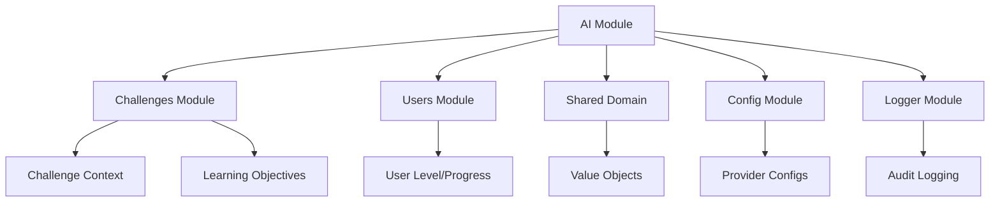
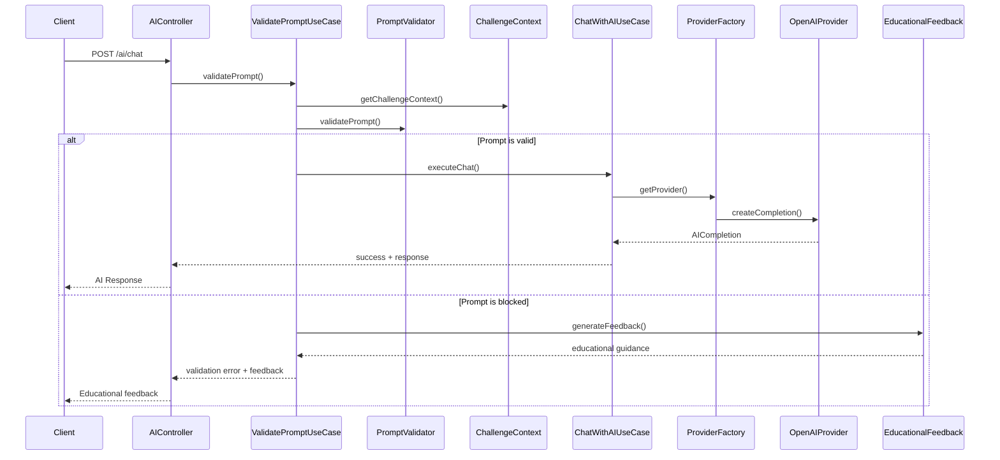

# Módulo de Inteligência Artificial (AI)

## 1. Visão Geral

### Propósito do Módulo
O módulo de IA é o cérebro da plataforma Journey, responsável por gerenciar todas as interações com modelos de linguagem natural para oferecer mentoria educacional inteligente. Vai muito além de um simples proxy para APIs de IA - implementa um sistema robusto de governança educacional que garante que as interações sejam pedagogicamente efetivas e seguras. É onde a tecnologia encontra a pedagogia.

### Responsabilidade Principal
- Orquestrar comunicação com múltiplos provedores de IA (OpenAI, Anthropic)
- Implementar governança educacional avançada com validação de prompts
- Detectar e prevenir tentativas de obter soluções diretas dos desafios
- Fornecer feedback educacional personalizado baseado no nível do usuário
- Rastrear e analisar padrões de uso para detectar comportamentos suspeitos
- Gerenciar quotas, rate limiting e custos de usage de IA
- Detectar copy/paste de código gerado por IA para métricas de dependência

### Posição na Arquitetura
O módulo atua como uma ponte inteligente entre usuários e provedores de IA, sendo consumido diretamente pelo frontend mas integrando-se profundamente com outros módulos:
- Módulo de challenges (contexto educacional e validação de relevância)
- Módulo de usuários (personalização por nível e histórico)
- Módulo de gamificação (penalidades por uso inadequado)
- Módulo de métricas (dados de dependência de IA e padrões de uso)

## 2. Arquitetura

### Padrões de Design Utilizados

A arquitetura segue rigidamente Clean Architecture com algumas adaptações específicas para IA:
- **Domain Layer**: Entidades, interfaces de provedores, tipos de dados educacionais e erros específicos
- **Application Layer**: Use cases que orquestram validação, análise e interação com IA
- **Infrastructure Layer**: Implementações concretas de provedores, serviços de validação e análise
- **Presentation Layer**: Controllers REST e controladores de governança

Patterns específicos implementados:
- **Strategy Pattern**: Diferentes provedores de IA (OpenAI, Anthropic) com interface unificada
- **Factory Pattern**: `ProviderFactoryService` cria instâncias apropriadas baseado em configuração
- **Observer Pattern**: Listeners para eventos de validação e feedback educacional
- **Template Method**: `PromptValidatorService` define fluxo de validação com steps específicos
- **Decorator Pattern**: Validação em camadas (sintática → semântica → contextual)
- **Proxy Pattern**: Cache inteligente para respostas de IA e validações

### Dependências de Outros Módulos


### Dependências Externas
- **openai v4.68.4**: SDK oficial para GPT models
- **@anthropic-ai/sdk v0.30.1**: SDK para Claude models
- **ioredis v5.4.1**: Cache para validações, contextos e rate limiting
- **@prisma/client v6.14.0**: Persistência de interações e métricas
- **zod v3.25.76**: Validação robusta de schemas de entrada

### Fluxo de Dados


## 3. Estrutura de Arquivos

```
src/modules/ai/
├── domain/
│   ├── entities/
│   │   └── ai-interaction.entity.ts        # Entidade de interação com IA
│   ├── errors/
│   │   ├── index.ts                        # Exportação centralizada
│   │   ├── ai.error.ts                     # Classe base para erros de IA
│   │   ├── validation.error.ts             # Erros de validação
│   │   ├── unauthorized.error.ts           # Acesso negado
│   │   ├── forbidden.error.ts              # Ação proibida
│   │   ├── invalid-provider.error.ts       # Provider inválido
│   │   ├── model-not-supported.error.ts    # Modelo não suportado
│   │   ├── challenge-not-found.error.ts    # Desafio não encontrado
│   │   ├── rate-limit-exceeded.error.ts    # Limite de rate excedido
│   │   ├── provider.error.ts               # Erros do provider
│   │   └── not-implemented.error.ts        # Funcionalidade não implementada
│   ├── providers/
│   │   └── ai-provider.interface.ts        # Interface para provedores de IA
│   ├── repositories/
│   │   └── ai-interaction.repository.interface.ts # Contrato para persistência
│   ├── schemas/
│   │   └── ai-interaction.schema.ts        # Validações Zod
│   ├── services/
│   │   ├── prompt-validator.service.interface.ts # Interface validação
│   │   ├── challenge-context.service.interface.ts # Interface contexto
│   │   ├── educational-feedback.service.interface.ts # Interface feedback
│   │   ├── temporal-analyzer.service.interface.ts # Interface análise temporal
│   │   ├── usage-quota.service.interface.ts # Interface quotas
│   │   └── rate-limit-info.service.interface.ts # Interface rate limit
│   └── types/
│       ├── ai.types.ts                     # Tipos base de IA
│       ├── governance.types.ts             # Tipos de governança
│       ├── validation.types.ts             # Tipos de validação
│       ├── context.types.ts                # Tipos de contexto
│       ├── educational-feedback.types.ts   # Tipos de feedback
│       └── temporal-analysis.types.ts      # Tipos de análise temporal
├── application/
│   └── use-cases/
│       ├── chat-with-ai.use-case.ts        # Interação principal com IA
│       ├── validate-prompt.use-case.ts     # Validação de prompts
│       ├── track-copy-paste.use-case.ts    # Rastreamento copy/paste
│       ├── analyze-conversation.use-case.ts # Análise de conversas
│       ├── analyze-temporal-behavior.use-case.ts # Análise temporal
│       ├── generate-educational-feedback.use-case.ts # Geração de feedback
│       ├── get-ai-models.use-case.ts       # Listagem de modelos
│       ├── get-ai-usage.use-case.ts        # Estatísticas de uso
│       ├── get-governance-metrics.use-case.ts # Métricas de governança
│       ├── get-governance-stats.use-case.ts # Estatísticas de governança
│       ├── refresh-challenge-cache.use-case.ts # Atualização de cache
│       ├── prewarm-cache.use-case.ts       # Pré-aquecimento de cache
│       ├── clear-validation-cache.use-case.ts # Limpeza de cache
│       └── analyze-prompt.use-case.ts      # Análise de prompts
├── infrastructure/
│   ├── config/
│   │   ├── openai.config.ts               # Configuração OpenAI
│   │   └── anthropic.config.ts            # Configuração Anthropic
│   ├── providers/
│   │   ├── openai.provider.ts             # Implementação OpenAI
│   │   └── anthropic.provider.ts          # Implementação Anthropic
│   ├── repositories/
│   │   └── ai-interaction.repository.ts   # Implementação com Prisma
│   ├── services/
│   │   ├── provider-factory.service.ts    # Factory de provedores
│   │   ├── prompt-validator.service.ts    # Validação de prompts
│   │   ├── hybrid-prompt-validator.service.ts # Validação híbrida
│   │   ├── semantic-analyzer.service.ts   # Análise semântica
│   │   ├── challenge-context.service.ts   # Contexto de desafios
│   │   ├── conversation-analyzer.service.ts # Análise de conversas
│   │   ├── temporal-analyzer.service.ts   # Análise temporal
│   │   ├── educational-feedback.service.ts # Feedback educacional
│   │   ├── copy-paste-detector.service.ts # Detecção copy/paste
│   │   ├── rate-limiter.service.ts        # Rate limiting
│   │   ├── usage-tracker.service.ts       # Rastreamento de uso
│   │   ├── usage-quota.service.ts         # Gerenciamento de quotas
│   │   └── rate-limit-info.service.ts     # Informações de rate limit
│   └── plugin/
│       └── ai.plugin.ts                   # Plugin do Fastify
└── presentation/
    ├── controllers/
    │   ├── ai.controller.ts               # Controller principal
    │   └── ai-governance.controller.ts    # Controller de governança
    └── routes/
        └── ai.routes.ts                   # Rotas HTTP
```

## 4. Componentes Principais

### 4.1 AIController
Localização: `src/modules/ai/presentation/controllers/ai.controller.ts`

É o ponto de entrada principal para interações com IA. Coordena validação, execução e rastreamento de todas as operações.

**Métodos principais:**
- `chat()`: Interface principal para conversas com IA com validação automática
- `trackCopyPaste()`: Rastreia eventos de copy/paste para métricas de dependência
- `getModels()`: Lista modelos disponíveis por provider
- `getUsage()`: Estatísticas de uso e quotas do usuário

```typescript
// Exemplo de uso completo
const response = await fetch('/api/ai/chat', {
  method: 'POST',
  headers: {
    'Content-Type': 'application/json',
    'Authorization': `Bearer ${accessToken}`
  },
  body: JSON.stringify({
    messages: [{
      role: 'user',
      content: 'Como posso melhorar a performance desta função de busca?'
    }],
    challengeId: 'cuid_challenge_123',
    attemptId: 'cuid_attempt_456',
    provider: 'openai',
    model: 'gpt-4o',
    config: {
      temperature: 0.7,
      maxTokens: 1000
    }
  })
});
```

### 4.2 PromptValidatorService
Localização: `src/modules/ai/infrastructure/services/prompt-validator.service.ts`

O coração da governança educacional. Implementa múltiplas camadas de validação para garantir que as interações sejam pedagogicamente apropriadas.

**Responsabilidades:**
- Detectar solicitações diretas de soluções com patterns em português
- Identificar tentativas de engenharia social e prompt injection
- Validar relevância contextual com o desafio atual
- Verificar padrões proibidos específicos do challenge
- Analisar complexidade do prompt vs. nível do usuário

**Configurações inteligentes:**
- Modo estrito vs. permissivo baseado no contexto
- Threshold de similaridade adaptável por categoria
- Detecção multilíngue (português + inglês para segurança)

### 4.3 EducationalFeedbackService
Localização: `src/modules/ai/infrastructure/services/educational-feedback.service.ts`

Sistema avançado de feedback educacional que adapta tom e conteúdo baseado no perfil do usuário.

**Características únicas:**
- Templates personalizados por nível (beginner, intermediate, advanced)
- Tom adaptável (encouraging, neutral, strict)
- Feedback contextual baseado no tipo de violação
- Sugestões de melhoria específicas e acionáveis
- Recursos de aprendizado personalizados

```typescript
// Feedback automático para prompt bloqueado
{
  context: {
    whatHappened: "Entendo sua tentativa, mas isso parece uma solicitação direta de solução.",
    whyBlocked: "Você pediu a solução completa ao invés de tentar entender o problema.",
    riskScore: 85,
    classification: "BLOCKED"
  },
  guidance: {
    immediateFix: [
      "Reformule perguntando sobre conceitos específicos",
      "Divida o problema em partes menores",
      "Pergunte sobre o 'porquê' ao invés do 'como fazer'"
    ],
    betterApproaches: [
      "Compartilhe seu raciocínio e peça validação",
      "Pergunte sobre casos extremos e tratamento de erros"
    ]
  }
}
```

### 4.4 ProviderFactoryService
Localização: `src/modules/ai/infrastructure/services/provider-factory.service.ts`

Factory inteligente que gerencia múltiplos provedores de IA com fallback automático e balanceamento de carga.

**Recursos avançados:**
- Auto-discovery de provedores baseado em variáveis de ambiente
- Fallback inteligente quando um provider está indisponível
- Cache distribuído para otimização de performance
- Métricas de saúde e latência por provider

### 4.5 Use Cases Especializados

#### ChatWithAIUseCase
Orquestra todo o fluxo de interação:
1. Validação de prompt via governança educacional
2. Seleção de provider ótimo baseado em modelo/carga
3. Execução da requisição com retry automático
4. Cálculo de custos e atualização de quotas
5. Registro de métricas e auditoria
6. Análise temporal de padrões de uso

#### ValidatePromptUseCase
Sistema de governança em múltiplas camadas:
1. Verificação sintática (patterns diretos de solução)
2. Análise semântica (quando habilitada)
3. Validação contextual (relevância com challenge)
4. Análise temporal (comportamento suspeito)
5. Geração de feedback educacional personalizado

## 5. Integrações

### 5.1 Com Outros Módulos Internos

**Challenges Module**: Integração profunda para contexto educacional. O AI module precisa entender completamente o desafio atual para validar relevância e detectar tentativas de obter soluções diretas.

**Users Module**: Personalização baseada em nível, histórico de progressão e preferências. Usuários iniciantes recebem feedback mais encorajador e explicações mais detalhadas.

**Gamification Module**: Integração bidirecional - IA pode influenciar XP baseado na qualidade das perguntas, enquanto gamificação pode modificar quotas e recursos disponíveis.

**Metrics Module**: Fornece dados críticos sobre dependência de IA, padrões de uso e efetividade educacional para dashboards e análises.

### 5.2 Como Outros Módulos Usam AI

```typescript
// Exemplo: Challenges module usando IA para geração de hints
const hint = await fastify.ai.chatWithAI.execute(userId, {
  messages: [{
    role: 'system',
    content: `Gere uma dica sutil para este desafio sem dar a solução: ${challengeDescription}`
  }],
  challengeId,
  provider: 'openai',
  model: 'gpt-3.5-turbo',
  config: { temperature: 0.8, maxTokens: 200 }
});

// Exemplo: Metrics module consumindo dados de dependência
const dependencyData = await fastify.ai.trackCopyPaste.execute(userId, {
  attemptId,
  action: 'paste',
  content: codeContent,
  sourceLines: 25,
  targetLines: 30
});
```

### 5.3 Contratos de Entrada e Saída

**Chat Input:**
```typescript
{
  messages: AIMessage[];          // Conversa completa
  challengeId?: string;           // Contexto do desafio (opcional)
  attemptId?: string;             // ID da tentativa (para tracking)
  provider: 'openai' | 'anthropic' | 'google';
  model: string;                  // Modelo específico
  config?: {
    temperature?: number;         // 0-2, criatividade
    maxTokens?: number;          // Limite de resposta
    stream?: boolean;            // Resposta em tempo real
  }
}
```

**AI Success Output:**
```typescript
{
  success: true,
  data: {
    id: string;                   // ID único da interação
    content: string;              // Resposta da IA
    usage: {
      promptTokens: number;
      completionTokens: number;
      totalTokens: number;
    },
    cost: number;                 // Custo em USD
  },
  usage: {
    tokens: number;               // Tokens usados nesta requisição
    cost: number;                 // Custo desta requisição
    remaining: number;            // Tokens restantes na quota
  },
  governance: {
    validated: boolean;           // Se passou pela validação
    challengeContext: boolean;    // Se tinha contexto de desafio
  }
}
```

**Validation Error Output (Educacional):**
```typescript
{
  error: 'PROMPT_VALIDATION_FAILED',
  message: 'Prompt bloqueado por políticas educacionais',
  reasons: string[];              // Motivos específicos
  riskScore: number;             // 0-100, nível de risco
  classification: 'SAFE' | 'WARNING' | 'BLOCKED';
  suggestions: string[];          // Sugestões de melhoria
  temporalAnalysis?: {           // Análise de comportamento
    patterns: string[];
    riskFactors: string[];
  },
  educationalFeedback: {
    context: {
      whatHappened: string;
      whyBlocked: string;
      riskScore: number;
    },
    guidance: {
      immediateFix: string[];
      betterApproaches: string[];
      conceptsToReview: string[];
    },
    learningPath: {
      currentStage: string;
      nextSteps: string[];
      estimatedProgress: number;
    }
  }
}
```

### 5.4 Endpoints Disponíveis

| Método | Endpoint | Função | Auth? | Roles |
|--------|----------|--------|-------|-------|
| POST | `/api/ai/chat` | Conversar com IA | Sim | Todos |
| POST | `/api/ai/track-copy-paste` | Rastrear copy/paste | Sim | Todos |
| GET | `/api/ai/usage` | Estatísticas de uso | Sim | Todos |
| GET | `/api/ai/models` | Modelos disponíveis | Sim | Todos |
| POST | `/api/ai/governance/validate` | Validar prompt | Sim | Todos |
| POST | `/api/ai/governance/analyze-temporal-behavior` | Análise temporal | Sim | Todos |
| POST | `/api/ai/governance/educational-feedback` | Gerar feedback | Sim | Todos |
| GET | `/api/ai/governance/metrics` | Métricas de governança | Sim | TECH_LEAD+ |
| GET | `/api/ai/governance/stats` | Estatísticas gerais | Sim | TECH_LEAD+ |
| POST | `/api/ai/governance/refresh-challenge-cache` | Refresh cache | Sim | TECH_LEAD+ |
| POST | `/api/ai/governance/prewarm-cache` | Pré-aquecer cache | Sim | TECH_LEAD+ |
| DELETE | `/api/ai/governance/cache` | Limpar cache | Sim | TECH_LEAD+ |

## 6. Tecnologias Utilizadas

### Stack Principal
**OpenAI SDK v4.68.4**: SDK oficial para acesso aos modelos GPT. Escolhemos pela maturidade, documentação excelente e suporte nativo a streaming.

**Anthropic SDK v0.30.1**: SDK para modelos Claude, conhecido pela segurança e capacidade de raciocínio. Importante para diversificação de provedores.

**Fastify v5.5.0**: Framework de alta performance que suporta naturalmente plugins modulares, essencial para a arquitetura extensível de IA.

**Redis v5.4.1**: Cache de alta performance para validações, contextos de desafios e rate limiting. Critical para performance em escala.

**Prisma v6.14.0**: ORM type-safe para persistência de interações, métricas e auditoria. Facilita análises complexas de uso.

### Ferramentas de Análise
- **Zod v3.25.76**: Validação robusta de schemas com inferência de tipos
- **Crypto**: Hash de prompts para cache inteligente e detecção de duplicatas
- **Winston**: Logging estruturado para auditoria e debugging

## 7. Decisões de Design

### 7.1 Governança Educacional Multi-Camada
Implementamos um sistema de validação em múltiplas camadas ao invés de uma abordagem simples de blacklist.

**Por que multi-camada?**
- **Detecção sintática**: Patterns diretos são rápidos de detectar e bloquear
- **Análise semântica**: Captura tentativas sofisticadas de manipulação
- **Validação contextual**: Garante relevância educacional
- **Análise temporal**: Detecta padrões suspeitos de comportamento

**Alternativas que consideramos:**
- **Blacklist simples**: Descartamos por ser facilmente contornável
- **Só análise semântica**: Muito custosa e lenta para todos os prompts
- **Moderação humana**: Inviável em escala, reservada para casos extremos

### 7.2 Abordagem Híbrida de Cache
Cache em múltiplas camadas: Redis para validações frequentes + cache local para providers.

**Raciocínio:**
- Validações são repetitivas (mesmo prompt, mesmo contexto)
- Respostas de IA podem ser cacheadas por algumas horas
- Contextos de desafios mudam raramente
- Rate limiting precisa ser global e rápido

**Trade-offs assumidos:**
- Complexidade adicional no gerenciamento de cache
- Possível inconsistência temporária entre instâncias
- Melhor performance e redução de custos significativa
- UX mais responsiva para operações frequentes

### 7.3 Feedback Educacional Personalizado
Sistema de templates adaptativos baseado no nível do usuário e tipo de violação.

**Motivação:**
- **Pedagógico**: Feedback inadequado pode desmotivar aprendizado
- **Efetividade**: Mensagens personalizadas têm maior impacto
- **Inclusão**: Usuários iniciantes precisam de mais encorajamento

Inspirado em teorias de feedback educacional e sistemas adaptativos de e-learning.

### 7.4 Múltiplos Provedores com Fallback
Suporte nativo a OpenAI, Anthropic.

**Vantagens estratégicas:**
- **Resiliência**: Se um provider cai, sistema continua funcionando
- **Otimização de custos**: Cada modelo tem pontos fortes diferentes
- **Qualidade**: Claude para raciocínio, GPT para código, etc.
- **Negociação**: Múltiplos fornecedores melhoram poder de barganha

```typescript
// Exemplo de seleção inteligente de provider
const providerStrategy = {
  'code-review': 'openai',      // GPT-4 é excelente para código
  'explanation': 'anthropic',   // Claude é melhor para explicações
  'creative': 'openai',         // GPT tem mais criatividade
  'reasoning': 'anthropic'      // Claude raciocina melhor
};
```

### 7.5 Detecção de Copy/Paste para Métricas Educacionais
Rastreamento não-intrusivo de eventos de copy/paste do código gerado por IA.

**Objetivos:**
- Medir dependência real dos usuários de código de IA
- Identificar padrões de uso saudável vs. problemático
- Fornecer dados para pesquisa educacional
- Alertar sobre possível overcoma

**Implementação respeitosa:**
- Opt-in transparente para usuários
- Dados anonimizados para análises
- Foco em padrões, não vigilância individual

## 8. Limitações e Melhorias Futuras

### 8.1 Limitações Atuais

**Análise Semântica Opcional**
A análise semântica avançada está desabilitada por padrão devido aos custos. Isso significa que tentativas sofisticadas de manipulação podem passar despercebidas.

**Cache de Contexto Simples**
O cache de contexto de desafios não é invalidado automaticamente quando challenges são atualizados, podendo levar a validações baseadas em dados antigos.

**Rate Limiting Básico**
Rate limiting atual é por usuário/tempo, mas não considera complexidade do prompt ou custo do modelo. Usuários podem esgotar quotas rapidamente com prompts complexos.

**Auditoria Manual**
Casos de validação duvidosos não são escalados automaticamente para revisão humana.

### 8.2 Casos Extremos Não Cobertos

1. **Prompt Injection Sofisticado**: Técnicas avançadas usando unicode, steganografia ou códigos podem contornar validação
2. **Coordenação Entre Usuários**: Múltiplos usuários podem coordenar para contornar rate limiting
3. **Adversarial Prompts**: Prompts que exploram falhas específicas dos modelos de IA
4. **Context Length Attacks**: Prompts extremamente longos para causar timeout ou erro

### 8.3 Roadmap de Melhorias

**Sistema de Moderação Híbrida**
Combinação de automação + revisão humana para casos ambíguos:

```typescript
interface ModerationWorkflow {
  autoDecision(prompt: string, context: any): 'approve' | 'reject' | 'escalate';
  queueForReview(prompt: string, analysis: any): Promise<string>;
  updateRulesFromFeedback(decisions: ModeratorDecision[]): Promise<void>;
}
```

**Análise Semântica em Tempo Real**
Implementar análise semântica para todos os prompts com otimizações:

```typescript
interface SemanticAnalyzer {
  analyzeIntent(prompt: string): Promise<PromptIntent>;
  detectManipulation(prompt: string): Promise<ManipulationScore>;
  compareWithSolutions(prompt: string, challengeId: string): Promise<SimilarityScore>;
}
```

**Rate Limiting Inteligente**
Rate limiting baseado em complexidade e contexto:

```typescript
interface IntelligentRateLimit {
  calculateCost(prompt: string, model: string): number;
  checkQuota(userId: string, estimatedCost: number): Promise<boolean>;
  adaptLimitsBasedOnBehavior(userId: string): Promise<RateLimitConfig>;
}
```

**Machine Learning para Detecção**
Sistema de ML treinado especificamente para detecção de tentativas educacionais vs. manipulação:

```typescript
interface MLValidator {
  trainOnInteractions(interactions: InteractionData[]): Promise<void>;
  predictIntent(prompt: string, context: any): Promise<IntentPrediction>;
  updateModel(feedbackData: ValidationFeedback[]): Promise<void>;
}
```

### 8.4 Débito Técnico Conhecido

- Configurações de providers ainda parcialmente hardcoded
- Falta de métricas de latência e disponibilidade por provider
- Sistema de logs poderia ser mais estruturado para análises
- Ausência de testes de carga para cenários de alta concorrência
- Cache invalidation strategy ainda manual

## 9. Testes

### 9.1 Estrutura Atual de Testes

Implementamos testes de integração robustos que cobrem todos os cenários críticos de governança educacional.

**Setup especializado:**
- Mock providers para testes determinísticos
- Redis isolado para cache testing
- Factory de prompts de teste (válidos, inválidos, edge cases)
- 89 test cases cobrindo validação, providers e governança

```typescript
describe('AI Module Integration Tests', () => {
  beforeEach(async () => {
    await cleanTestData(prisma);
    await redis.flushdb();
    await setupMockProviders(); // Providers determinísticos
  });

  describe('Prompt Validation', () => {
    test('blocks direct solution requests in Portuguese', async () => {
      const prompt = 'me dá a solução completa deste desafio';
      const result = await validatePrompt(prompt, challengeContext);
      expect(result.classification).toBe('BLOCKED');
    });
  });

  describe('Educational Feedback', () => {
    test('adapts tone based on user level', async () => {
      const beginnerFeedback = await generateFeedback(blockedValidation, 1);
      const advancedFeedback = await generateFeedback(blockedValidation, 8);

      expect(beginnerFeedback.tone).toBe('encouraging');
      expect(advancedFeedback.tone).toBe('strict');
    });
  });
});
```

### 9.2 Cenários de Teste Cobertos

**Validação de Prompts:**
- Detecção de solicitações diretas em português
- Identificação de tentativas de engenharia social
- Validação de relevância contextual
- Análise de complexidade vs. nível do usuário

**Providers:**
- Fallback automático entre providers
- Cache de respostas e invalidação
- Cálculo correto de custos por modelo
- Rate limiting por provider

**Feedback Educacional:**
- Personalização por nível de usuário
- Adaptação de tom baseada no contexto
- Geração de sugestões específicas
- Progressão de learning path

### 9.3 Como Executar

```bash
# Setup completo com providers mockados
npm run test:setup
npm run test:ai           # Testes específicos do módulo AI
npm run test:ai:watch     # Watch mode para desenvolvimento

# Testes de performance
npm run test:ai:load      # Simula carga alta de validações

# Testes de governança
npm run test:governance   # Foco em cenários educacionais
```

## 10. Exemplos de Uso

### 10.1 Implementação no Frontend

```typescript
class AIService {
  async chatWithAI(
    messages: AIMessage[],
    challengeId?: string,
    config?: AIConfig
  ): Promise<AIResponse> {
    try {
      const response = await fetch('/api/ai/chat', {
        method: 'POST',
        headers: {
          'Content-Type': 'application/json',
          'Authorization': `Bearer ${this.accessToken}`
        },
        body: JSON.stringify({
          messages,
          challengeId,
          attemptId: this.currentAttemptId,
          provider: config?.provider || 'openai',
          model: config?.model || 'gpt-4o',
          config: {
            temperature: config?.temperature || 0.7,
            maxTokens: config?.maxTokens || 1000
          }
        })
      });

      if (response.ok) {
        return await response.json();
      }

      // Tratar erro educacional
      if (response.status === 403) {
        const errorData = await response.json();
        this.showEducationalFeedback(errorData.educationalFeedback);
        throw new EducationalBlockError(errorData);
      }

      throw new AIServiceError('Failed to communicate with AI');
    } catch (error) {
      this.handleAIError(error);
      throw error;
    }
  }

  private showEducationalFeedback(feedback: EducationalFeedback) {
    // Mostrar feedback personalizado no UI
    const modal = new FeedbackModal({
      title: 'Vamos melhorar sua pergunta!',
      content: feedback.guidance.immediateFix,
      tone: feedback.tone,
      suggestions: feedback.guidance.betterApproaches
    });
    modal.show();
  }

  // Auto-tracking de copy/paste
  async trackCopyPaste(action: 'copy' | 'paste', content: string) {
    if (!this.userOptedInTracking) return;

    await fetch('/api/ai/track-copy-paste', {
      method: 'POST',
      headers: {
        'Content-Type': 'application/json',
        'Authorization': `Bearer ${this.accessToken}`
      },
      body: JSON.stringify({
        attemptId: this.currentAttemptId,
        action,
        content,
        sourceLines: this.countLines(content),
        targetLines: action === 'paste' ? this.getTargetLines() : undefined,
        timestamp: Date.now()
      })
    });
  }
}
```

### 10.2 Integração com Challenges Module

```typescript
class ChallengeController {
  async generateHint(challengeId: string, userLevel: number): Promise<string> {
    const challenge = await this.challengeRepository.findById(challengeId);

    // Usar IA para gerar hint sem dar solução
    const hintResponse = await this.aiService.chatWithAI([{
      role: 'system',
      content: `Você é um mentor educacional. Gere uma dica sutil para este desafio de programação sem revelar a solução:

Desafio: ${challenge.title}
Descrição: ${challenge.description}
Nível do usuário: ${userLevel}/10

A dica deve:
- Ser específica mas não dar a resposta
- Estar apropriada para o nível do usuário
- Encorajar o pensamento crítico
- Ter no máximo 2 frases`
    }], challengeId, {
      model: 'gpt-3.5-turbo',
      temperature: 0.8,
      maxTokens: 150
    });

    return hintResponse.data.content;
  }
}
```

### 10.3 Sistema de Governança Personalizada

```typescript
class GovernanceController {
  async validateChallengePrompt(
    challengeId: string,
    prompt: string,
    userLevel: number
  ): Promise<ValidationResult> {
    const validation = await this.validatePromptUseCase.execute({
      challengeId,
      prompt,
      userLevel,
      config: {
        strictMode: userLevel >= 8, // Mais rigoroso para experts
        contextSimilarityThreshold: 0.7,
        blockDirectSolutions: true,
        enableSemanticAnalysis: true
      }
    });

    if (!validation.isValid) {
      // Gerar feedback educacional personalizado
      const feedback = await this.educationalFeedbackUseCase.execute({
        validation,
        userLevel,
        challengeId
      });

      throw new ValidationError({
        ...validation,
        educationalFeedback: feedback
      });
    }

    return validation;
  }
}
```

### 10.4 Análise Temporal de Comportamento

```typescript
class TemporalAnalysisController {
  async analyzeUserBehavior(userId: string): Promise<BehaviorAnalysis> {
    const analysis = await this.temporalAnalyzerUseCase.execute({
      userId,
      timeWindow: '24h',
      analysisType: 'interaction_pattern'
    });

    // Detectar padrões suspeitos
    const suspiciousPatterns = [];

    if (analysis.promptFrequency > 50) {
      suspiciousPatterns.push('high_frequency_prompting');
    }

    if (analysis.solutionSeekingRatio > 0.7) {
      suspiciousPatterns.push('solution_seeking_behavior');
    }

    if (analysis.copyPasteRatio > 0.9) {
      suspiciousPatterns.push('excessive_copy_paste');
    }

    // Gerar recomendações educacionais
    const recommendations = await this.generateBehaviorRecommendations(
      analysis,
      suspiciousPatterns
    );

    return {
      analysis,
      suspiciousPatterns,
      recommendations,
      riskScore: this.calculateBehaviorRiskScore(analysis),
      suggestedActions: this.getSuggestedActions(suspiciousPatterns)
    };
  }

  private async generateBehaviorRecommendations(
    analysis: BehaviorAnalysis,
    patterns: string[]
  ): Promise<string[]> {
    if (patterns.includes('solution_seeking_behavior')) {
      return [
        'Foque em entender conceitos ao invés de buscar soluções prontas',
        'Tente dividir problemas complexos em partes menores',
        'Pratique explicar seu raciocínio antes de implementar'
      ];
    }

    if (patterns.includes('excessive_copy_paste')) {
      return [
        'Experimente implementar soluções por conta própria',
        'Use IA como mentor, não como fonte de código pronto',
        'Pratique debugging e adaptação de código'
      ];
    }

    return [
      'Continue explorando e experimentando',
      'Sua abordagem de aprendizado está equilibrada'
    ];
  }
}
```

---

Documentação gerada para TCC - Journey v1.0
Última atualização: 06-10-2025