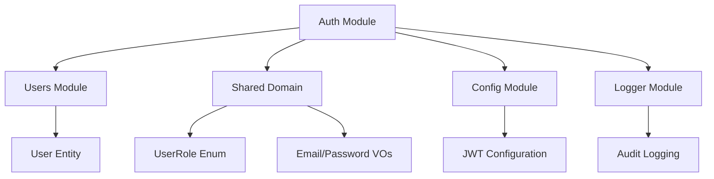
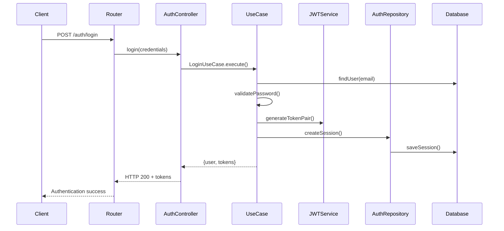

# Módulo de Autenticação (Auth)

## 1. Visão Geral

### Propósito do Módulo
O módulo de autenticação gerencia toda a segurança de acesso à plataforma Journey. Ele implementa um sistema de autenticação baseado em JWT com refresh tokens, controle de sessões e autorização por roles. Basicamente, é a primeira linha de defesa da aplicação - nada entra sem passar por aqui primeiro.

### Responsabilidade Principal
- Verificar se o usuário é quem diz ser (email/senha)
- Controlar o que cada tipo de usuário pode fazer (JUNIOR, SENIOR, TECH_LEAD, ARCHITECT)
- Criar, validar e renovar tokens JWT
- Rastrear sessões ativas e invalidá-las quando necessário
- Proteger rotas e endpoints através de middlewares

### Posição na Arquitetura
O módulo funciona como um middleware transversal - praticamente todos os outros módulos dependem dele para controle de acesso. Está na camada de infraestrutura e serve:
- Módulo de usuários (integração direta para criação e validação)
- Módulo de gamificação (verifica se usuário pode acessar funcionalidades premium)
- Módulo de IA (controla rate limiting por usuário)
- Módulo de desafios (verifica se usuário pode modificar seus próprios challenges)

## 2. Arquitetura

### Padrões de Design Utilizados

A estrutura segue Clean Architecture bem rigidamente:
- **Domain Layer**: Entidades, interfaces de repositórios, erros específicos do domínio e schemas de validação
- **Application Layer**: Use cases que orquestram toda a lógica de negócio
- **Infrastructure Layer**: Implementações concretas, integrações externas, middlewares
- **Presentation Layer**: Controllers e definição de rotas HTTP

Alguns patterns específicos que implementamos:
- **Singleton**: O `JWTService` garante uma única instância em toda aplicação
- **Factory**: `SessionEntity.create()` centraliza a criação consistente de sessões
- **Strategy**: Diferentes estratégias de autenticação (obrigatória, opcional, por role)
- **Repository**: `IAuthRepository` abstrai completamente a persistência
- **Decorator**: Proteção declarativa de rotas através de decorators

### Dependências de Outros Módulos


### Dependências Externas
- **@fastify/jwt**: Para manipulação de tokens JWT
- **bcryptjs**: Hash seguro de senhas
- **@prisma/client**: ORM para persistência
- **zod**: Validação robusta de schemas
- **ioredis**: Cache de sessões (quando configurado)

### Fluxo de Dados


## 3. Estrutura de Arquivos

```
src/modules/auth/
├── domain/
│   ├── entities/
│   │   └── session.entity.ts           # Entidade de sessão com lógica de negócio
│   ├── errors/
│   │   ├── index.ts                    # Exportação centralizada
│   │   ├── auth.error.ts               # Classe base para todos os erros
│   │   ├── invalid-credentials.error.ts # Credenciais inválidas
│   │   ├── email-already-exists.error.ts # Email já existe
│   │   ├── token-invalid.error.ts      # Token JWT inválido
│   │   ├── token-expired.error.ts      # Token JWT expirado
│   │   ├── unauthorized.error.ts       # Acesso negado
│   │   ├── user-not-found.error.ts     # Usuário não encontrado
│   │   ├── session-not-found.error.ts  # Sessão inexistente
│   │   └── validation.error.ts         # Erros de validação Zod
│   ├── repositories/
│   │   └── auth.repository.interface.ts # Contrato para persistência
│   └── schemas/
│       └── auth.schema.ts              # Validações Zod
├── application/
│   └── use-cases/
│       ├── register.use-case.ts        # Registro de usuários
│       ├── login.use-case.ts           # Login de usuários
│       ├── logout.use-case.ts          # Invalidação de sessões
│       └── refresh-token.use-case.ts   # Renovação de tokens
├── infrastructure/
│   ├── decorators/
│   │   └── auth.decorator.ts           # Decoradores para proteção
│   ├── guards/
│   │   └── role.guard.ts               # Guards para autorização
│   ├── middleware/
│   │   └── auth.middleware.ts          # Middleware de autenticação
│   ├── repositories/
│   │   └── auth.repository.ts          # Implementação com Prisma
│   ├── services/
│   │   └── jwt.service.ts              # Manipulação de JWT
│   └── plugin/
│       └── auth.plugin.ts              # Plugin do Fastify
└── presentation/
    ├── controllers/
    │   └── auth.controller.ts          # Controller REST
    └── routes/
        └── auth.routes.ts              # Rotas HTTP
```

## 4. Componentes Principais

### 4.1 AuthController
Localização: `src/modules/auth/presentation/controllers/auth.controller.ts`

É o ponto de entrada HTTP para todas as operações de autenticação. Recebe as requisições, valida os dados e coordena a execução dos use cases.

**Métodos principais:**
- `register()`: Cria novos usuários no sistema
- `login()`: Autentica usuários existentes
- `logout()`: Invalida sessões ativas
- `refreshToken()`: Renova tokens expirados
- `getCurrentUser()`: Retorna perfil do usuário logado

```typescript
// Exemplo de uso no frontend
const response = await fetch('/api/auth/register', {
  method: 'POST',
  headers: { 'Content-Type': 'application/json' },
  body: JSON.stringify({
    email: 'usuario@exemplo.com',
    password: 'MinhaSenh@123',
    name: 'João Silva',
    acceptTerms: true
  })
});
```

### 4.2 JWTService
Localização: `src/modules/auth/infrastructure/services/jwt.service.ts`

Centraliza todas as operações com JWT. Implementa Singleton para garantir configuração única em toda aplicação.

**Responsabilidades:**
- Gerar pares de tokens (access + refresh)
- Validar e decodificar tokens
- Renovar tokens através do refresh token

**Configurações atuais:**
- Access Token: 15 minutos (balanceia segurança vs. UX)
- Refresh Token: 7 dias (permite login persistente)
- Algoritmo: HS256 (simétrico, mais simples de gerenciar)

### 4.3 AuthMiddleware
Localização: `src/modules/auth/infrastructure/middleware/auth.middleware.ts`

Intercepta requisições HTTP e valida autenticação/autorização antes de chegar aos controllers.

**Três tipos de middleware:**
- `authenticate()`: Validação obrigatória - bloqueia sem token válido
- `authorize(roles)`: Verifica se usuário tem role necessária
- `optionalAuth()`: Autenticação opcional - não bloqueia, apenas injeta dados se disponível

O fluxo é simples: extrai token do header Authorization, valida via JWTService, injeta dados do usuário no request ou retorna erro.

### 4.4 Use Cases

#### RegisterUseCase
Orquestra todo o processo de registro:
1. Verifica se email já existe
2. Cria entidade User com senha hasheada
3. Persiste no banco
4. Gera tokens JWT
5. Cria sessão
6. Registra logs de auditoria

Tudo encapsulado em uma transação para garantir consistência.

#### LoginUseCase
Gerencia autenticação:
1. Busca usuário por email
2. Valida senha (bcrypt compare)
3. Atualiza timestamp de último login
4. Gera novo par de tokens
5. Cria nova sessão

Uma decisão importante: retornamos o mesmo erro para "email não existe" e "senha inválida" para prevenir user enumeration.

### 4.5 SessionEntity
Localização: `src/modules/auth/domain/entities/session.entity.ts`

Entidade de domínio que encapsula toda lógica relacionada a sessões de usuário.

**Dados que mantém:**
- Identificadores (session ID, user ID)
- Token de refresh
- Contexto de segurança (IP, User-Agent)
- Timestamps (criação, expiração, última atividade)

**Métodos úteis:**
- `isExpired()`: Verifica se sessão ainda é válida
- `updateActivity()`: Atualiza último acesso (para analytics)

## 5. Integrações

### 5.1 Com Outros Módulos Internos
O módulo auth é consumido intensivamente:

**Users Module**: Usa `UserEntity` para criação e validação de usuários. A integração é bem acoplada porque auth essencialmente gerencia o ciclo de vida das credenciais dos usuários.

**Shared Domain**: Consome enums de roles e value objects para email/senha. Isso garante consistência nas validações em toda aplicação.

**Config Module**: Puxa todas as configurações de JWT, rate limiting, CORS. Centralizamos isso para facilitar mudanças entre ambientes.

**Logger**: Cada operação importante gera logs estruturados para auditoria e debugging.

### 5.2 Como Outros Módulos Usam Auth
```typescript
// Exemplo típico: proteger endpoint de gamificação
app.get('/api/gamification/dashboard', {
  preHandler: [
    authMiddleware.authenticate,
    authMiddleware.authorize(['JUNIOR', 'SENIOR'])
  ],
  handler: gamificationController.getDashboard
});
```

### 5.3 Contratos de Entrada e Saída

**Register Input:**
```typescript
{
  email: string;        // Validação rigorosa de formato
  password: string;     // Min 8 chars, deve ter maiúscula, minúscula, número, especial
  name: string;         // Entre 2 e 100 caracteres
  companyId?: string;   // CUID opcional para empresas
  acceptTerms: boolean; // Obrigatório ser true
}
```

**Auth Success Output:**
```typescript
{
  success: true,
  data: {
    user: {
      id: string;
      email: string;
      name: string;
      role: UserRole;
      currentLevel: number;
      totalXp: number;
      // outros campos do perfil
    },
    accessToken: string;   // JWT para requests imediatos
    refreshToken: string;  // JWT para renovação
  }
}
```

### 5.4 Endpoints Disponíveis

| Método | Endpoint | Função | Auth? |
|--------|----------|--------|-------|
| POST | `/api/auth/register` | Criar conta | Não |
| POST | `/api/auth/login` | Entrar na conta | Não |
| POST | `/api/auth/logout` | Sair e invalidar sessão | Sim |
| POST | `/api/auth/refresh` | Renovar tokens | Não |
| GET | `/api/auth/me` | Dados do usuário logado | Sim |

## 6. Tecnologias Utilizadas

### Stack Principal
**Fastify v5.5.0**: Escolhemos em vez do Express pela performance superior e TypeScript nativo. O sistema de plugins do Fastify também facilitou a integração do JWT.

**@fastify/jwt v10.0.0**: Plugin oficial que abstrai a complexidade do JWT. Integra perfeitamente com hooks do Fastify.

**Prisma v6.14.0**: ORM que escolhemos pela excelente experiência de desenvolvimento e type safety. O Prisma Client gerado elimina muito boilerplate.

**Zod v3.25.76**: Validação de schemas em runtime com inferência de tipos. Muito mais robusto que validações manuais.

**bcryptjs v3.0.2**: Para hash de senhas. Preferimos sobre bcrypt puro pela compatibilidade multiplataforma.

### Ferramentas de Desenvolvimento
- **Vitest**: Framework de testes moderno, mais rápido que Jest
- **TypeScript**: Type safety em toda aplicação
- **ESLint + Prettier**: Padronização de código

## 7. Decisões de Design

### 7.1 JWT + Database Sessions (Abordagem Híbrida)
Optamos por não seguir a abordagem puramente stateless do JWT nem a puramente stateful das sessions tradicionais.

**Por que híbrido?**
- JWT permite escalabilidade horizontal (stateless authentication)
- Database sessions permitem invalidação imediata e auditoria
- Refresh tokens persistidos balanceiam segurança com experiência do usuário

**Alternativas que consideramos:**
- **Só JWT**: Descartamos porque não conseguiríamos invalidar tokens instantaneamente
- **Só Sessions**: Descartamos pela dificuldade de escalar horizontalmente
- **OAuth 2.0**: Consideramos overkill para um MVP, mas pode ser implementado futuramente

### 7.2 Duração dos Tokens
Access token de 15 minutos + refresh token de 7 dias.

**Raciocínio:**
- 15 minutos minimiza janela de exposição se token vazar
- 7 dias evita relogins frequentes que irritam usuários
- Refresh automático no frontend torna processo transparente

**Trade-offs que assumimos:**
- Mais complexidade no frontend (precisa implementar refresh automático)
- Mais requisições de rede (renovações periódicas)
- Melhor segurança (exposição limitada)
- UX preservada (usuário não percebe renovações)

### 7.3 Arquitetura em Camadas
Separação rígida entre Domain, Application, Infrastructure e Presentation.

**Motivação:**
- **Testabilidade**: Use cases podem ser testados isoladamente sem dependências externas
- **Manutenibilidade**: Mudanças na infraestrutura não quebram regras de negócio
- **Flexibilidade**: Trocar Prisma por outro ORM não afeta use cases

Isso foi inspirado principalmente no "Clean Architecture" do Uncle Bob e conceitos de DDD.

### 7.4 Error Handling com Classes Customizadas
Cada tipo de erro tem sua própria classe com código específico:

```typescript
export class InvalidCredentialsError extends AuthError {
  constructor() {
    super('Invalid email or password', 'AUTH_INVALID_CREDENTIALS', 401);
  }
}
```

**Vantagens:**
- Debugging mais fácil com códigos únicos
- Frontend pode tratar erros específicos
- Facilita internacionalização
- API consistency em todos endpoints

## 8. Limitações e Melhorias Futuras

### 8.1 Limitações Atuais

**Controle de Sessões Múltiplas**
Atualmente não limitamos quantas sessões um usuário pode ter simultaneamente. Na prática, alguém pode logar em 50 dispositivos diferentes e todas as sessões permanecem ativas até expirar naturalmente.

**Rate Limiting Básico**
O rate limiting atual é global via Fastify, não granular por usuário ou IP. Isso nos deixa vulneráveis a ataques distribuídos de força bruta.

**Auditoria Simples**
Temos logs básicos, mas falta um dashboard de segurança e alertas automáticos para padrões suspeitos.

### 8.2 Casos Extremos Não Cobertos

1. **Race Conditions**: Registro simultâneo com mesmo email pode passar pela validação
2. **Token Replay**: Não validamos se token já foi usado recentemente
3. **Session Hijacking**: Falta validação adicional de fingerprinting de dispositivo
4. **Password Policy Dinâmica**: Política atual é estática no código

### 8.3 Roadmap de Melhorias

**Session Management Avançado**
Implementar controle granular de sessões com limitação por dispositivo:

```typescript
interface SessionManager {
  createSession(userId: string, deviceInfo: DeviceInfo): Promise<Session>;
  invalidateDevice(userId: string, deviceId: string): Promise<void>;
  invalidateAllExcept(userId: string, currentSessionId: string): Promise<void>;
}
```

**OAuth/SSO Integration**
Preparar estrutura para OAuth providers:

```typescript
interface OAuthProvider {
  authorize(code: string): Promise<OAuthUser>;
  getProfile(token: string): Promise<UserProfile>;
}
```

**Rate Limiting Granular**
Rate limiting por usuário e tipo de operação:

```typescript
interface RateLimiter {
  checkLimit(userId: string, operation: string): Promise<boolean>;
  getRemainingAttempts(userId: string, operation: string): Promise<number>;
}
```

### 8.4 Débito Técnico Conhecido

- Configurações hardcoded que deveriam vir do ambiente
- Falta de testes de integração com Redis
- Alguns error cases ainda retornam strings genéricas
- Ausência de métricas de performance e monitoring

## 9. Testes

### 9.1 Estrutura Atual de Testes

Implementamos testes de integração completos que cobrem os endpoints de ponta a ponta com banco real de testes.

**Setup do ambiente:**
- Docker Compose com PostgreSQL e Redis isolados
- Limpeza automática de dados entre testes
- 47 test cases cobrindo cenários happy path e edge cases

```typescript
describe('Authentication Integration Tests', () => {
  beforeEach(async () => {
    await cleanTestData(prisma);  // Banco limpo a cada teste
    await redis.flushdb();       // Cache limpo também
  });

  // Suites organizadas por endpoint
  describe('POST /auth/register', () => { /* 6 casos */ });
  describe('POST /auth/login', () => { /* 4 casos */ });
  describe('POST /auth/refresh', () => { /* 3 casos */ });
  // ...
});
```

### 9.2 Cenários de Teste Cobertos

**Registro:**
- Sucesso com dados válidos
- Falha com email inválido/senha fraca/email duplicado
- Validação de aceitação de termos

**Login:**
- Sucesso e falha com credenciais válidas/inválidas
- Atualização do timestamp de último login
- Validação de formato de email

**Tokens:**
- Refresh bem-sucedido e com token inválido
- Validação de novos tokens gerados
- Verificação de invalidação após logout

### 9.3 Como Executar

```bash
# Setup completo
npm run test:setup      # Sobe infraestrutura Docker
npm run test:auth       # Executa testes específicos de auth
npm run test:teardown   # Derruba infraestrutura

# Durante desenvolvimento
npm run test:watch tests/modules/auth
```

**Nota importante:** Coverage ainda não está configurado - está na lista de débito técnico.

## 10. Exemplos de Uso

### 10.1 Implementação no Frontend

```typescript
class AuthService {
  private accessToken: string | null = null;
  private refreshToken: string | null = null;

  async login(email: string, password: string) {
    const response = await fetch('/api/auth/login', {
      method: 'POST',
      headers: { 'Content-Type': 'application/json' },
      body: JSON.stringify({ email, password })
    });

    if (response.ok) {
      const { data } = await response.json();
      this.accessToken = data.accessToken;
      this.refreshToken = data.refreshToken;
      return data.user;
    }

    throw new Error('Login failed');
  }

  // Requisições com refresh automático
  async makeAuthenticatedRequest(url: string, options: RequestInit = {}) {
    let response = await fetch(url, {
      ...options,
      headers: {
        ...options.headers,
        'Authorization': `Bearer ${this.accessToken}`
      }
    });

    // Se token expirou, tentar refresh automaticamente
    if (response.status === 401) {
      await this.refreshTokens();

      response = await fetch(url, {
        ...options,
        headers: {
          ...options.headers,
          'Authorization': `Bearer ${this.accessToken}`
        }
      });
    }

    return response;
  }

  private async refreshTokens() {
    const response = await fetch('/api/auth/refresh', {
      method: 'POST',
      headers: { 'Content-Type': 'application/json' },
      body: JSON.stringify({ refreshToken: this.refreshToken })
    });

    if (response.ok) {
      const { data } = await response.json();
      this.accessToken = data.accessToken;
      this.refreshToken = data.refreshToken;
    } else {
      // Força novo login
      window.location.href = '/login';
    }
  }
}
```

### 10.2 Proteção de Rotas no Backend

```typescript
// Proteção básica - só usuários autenticados
app.get('/api/protected', {
  preHandler: [authMiddleware.authenticate],
  handler: async (request, reply) => {
    const user = request.user; // Disponível após middleware
    return reply.send({ message: `Olá ${user.email}` });
  }
});

// Proteção por role - só admins
app.delete('/api/admin/users/:id', {
  preHandler: [
    authMiddleware.authenticate,
    authMiddleware.authorize(['TECH_LEAD', 'ARCHITECT'])
  ],
  handler: adminController.deleteUser
});

// Autenticação opcional - conteúdo muda se logado
app.get('/api/public-with-context', {
  preHandler: [authMiddleware.optionalAuth],
  handler: async (request, reply) => {
    const user = request.user; // undefined se não logado
    return reply.send({
      message: user ? `Bem-vindo de volta ${user.email}` : 'Visitante anônimo'
    });
  }
});
```

### 10.3 Verificação de Ownership

```typescript
// Exemplo no controller de challenges
class ChallengeController {
  async updateChallenge(request: FastifyRequest, reply: FastifyReply) {
    const { challengeId } = request.params;

    const challenge = await this.challengeRepository.findById(challengeId);

    // Verifica se usuário pode modificar (dono ou admin)
    const canModify = await RoleGuard.checkOwnership(request, challenge.createdBy);

    if (!canModify) {
      return reply.status(403).send({
        error: 'Forbidden',
        message: 'Você só pode modificar seus próprios desafios'
      });
    }

    // Procede com a atualização...
  }
}
```

### 10.4 Rate Limiting Personalizado

```typescript
// Middleware combinando auth + rate limiting diferenciado
const gamificationRateLimit = async (request: FastifyRequest, reply: FastifyReply) => {
  await authMiddleware.authenticate(request, reply);

  const isPremium = RoleGuard.canAccessPremiumFeatures(request);
  const maxRequests = isPremium ? 100 : 20; // Premium users têm mais requests

  // Implementar verificação de rate limiting...
};

// Usar no módulo de gamificação
app.post('/api/gamification/boost', {
  preHandler: [gamificationRateLimit],
  handler: gamificationController.applyBoost
});
```

---

Documentação gerada para TCC - Journey v1.0
Última atualização: 05-10-2025