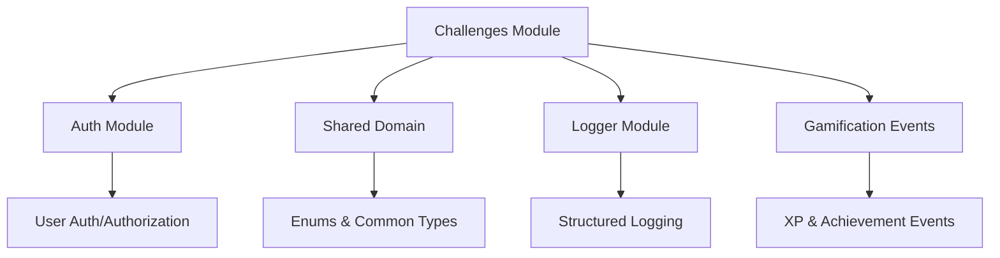

# Módulo de Challenges

## 1. Visão Geral

### Propósito do Módulo
O módulo de challenges é onde toda a magia acontece na plataforma Journey. É ele que gerencia os desafios de programação, executa código dos usuários de forma segura e detecta armadilhas de segurança em tempo real. Basicamente, transforma aprender programação numa experiência gamificada e educativa - você não só resolve problemas, mas aprende sobre vulnerabilidades reais no processo.

### Responsabilidade Principal
- Criar e gerenciar desafios de programação (CRUD completo)
- Executar código submetido pelos usuários via Judge0 API
- Detectar armadilhas de segurança, performance e lógica no código
- Calcular pontuação baseada em qualidade de código e testes
- Gerar feedback automático e inteligente para os usuários
- Rastrear tentativas e progresso dos usuários nos challenges

### Posição na Arquitetura
Funciona como o módulo central da plataforma - todos os outros orbitam ao seu redor:
- **Auth Module**: Valida quem pode criar/modificar challenges e tracking de tentativas
- **Gamification Module**: Recebe eventos de completion para triggerar conquistas e XP
- **AI Module**: Consome contexto dos challenges para feedback mais inteligente
- **Analytics Module**: Usa dados de performance e engagement dos challenges

## 2. Arquitetura

### Padrões de Design Utilizados

Seguimos Clean Architecture religiosamente - cada camada tem responsabilidades bem definidas:
- **Domain Layer**: Entidades, interfaces, regras de negócio puras, erros específicos
- **Application Layer**: Use cases que orquestram toda a lógica complexa
- **Infrastructure Layer**: Implementações concretas, APIs externas, persistência
- **Presentation Layer**: Controllers, rotas HTTP, validação de entrada

Padrões específicos que aplicamos:
- **Repository Pattern**: `IChallengeRepository` abstrai completamente a persistência
- **Factory**: `ChallengeEntity.create()` centraliza criação consistente de challenges
- **Strategy**: Diferentes estratégias de detecção de armadilhas por tipo/linguagem
- **Observer**: Sistema de eventos para notificar outros módulos sobre completions
- **Template Method**: Fluxo padronizado de execução e análise de código

### Dependências de Outros Módulos


### Dependências Externas
- **@prisma/client**: ORM type-safe para PostgreSQL
- **@fastify/jwt**: Integração JWT via auth plugin
- **axios**: Cliente HTTP para Judge0 API
- **ioredis**: Cache inteligente para execuções
- **zod**: Validação robusta de schemas
- **crypto**: UUIDs e hashing de código

### Fluxo de Dados
```mermaid
sequenceDiagram
    participant C as Client
    participant R as Router
    participant CC as ChallengeController
    participant UC as SubmitSolutionUseCase
    participant JS as Judge0Service
    parameter TD as TrapDetector
    participant CR as ChallengeRepository
    participant DB as Database

    C->>R: POST /challenges/submit
    R->>CC: submitSolution(code)
    CC->>UC: SubmitSolutionUseCase.execute()
    UC->>DB: findChallenge(id)
    UC->>JS: executeCode(code, testCases)
    JS->>JS: Judge0 API calls
    UC->>TD: detectTraps(code)
    UC->>CR: updateAttempt(results)
    CR->>DB: saveAttemptData()
    UC-->>CC: {score, passed, feedback}
    CC-->>R: HTTP 200 + results
    R-->>C: Execution results
```

## 3. Estrutura de Arquivos

```
src/modules/challenges/
├── application/
│   └── use-cases/
│       ├── analyze-code.use-case.ts        # Análise de código e detecção de traps
│       ├── create-challenge.use-case.ts    # Criação de novos desafios
│       ├── delete-challenge.use-case.ts    # Remoção de desafios
│       ├── get-challenge.use-case.ts       # Busca individual por ID/slug
│       ├── list-challenges.use-case.ts     # Listagem com filtros
│       ├── start-challenge.use-case.ts     # Início de tentativa
│       ├── submit-solution.use-case.ts     # Submissão de solução
│       └── update-challenge.use-case.ts    # Atualização de desafios
├── domain/
│   ├── entities/
│   │   └── challenge.entity.ts             # Entidade principal do domínio
│   ├── repositories/
│   │   └── challenge.repository.interface.ts # Contrato do repositório
│   ├── schemas/
│   │   └── challenge.schema.ts             # Schemas de validação Zod
│   ├── services/
│   │   └── trap-detector.service.ts        # Detector de armadilhas
│   ├── types/
│   │   └── challenge.types.ts              # Types TypeScript
│   └── errors/
│       ├── index.ts                        # Barrel export
│       ├── challenge.error.ts              # Erro base
│       ├── challenge-not-found.error.ts    # Challenge não encontrado
│       ├── challenge-slug-exists.error.ts  # Slug duplicado
│       ├── attempt-*.error.ts              # Erros de tentativa
│       └── [outros erros específicos]
├── infrastructure/
│   ├── repositories/
│   │   └── challenge.repository.ts         # Implementação Prisma
│   ├── services/
│   │   └── judge0.service.ts              # Integração Judge0
│   └── plugin/
│       └── challenge.plugin.ts            # Plugin Fastify
└── presentation/
    ├── controllers/
    │   └── challenge.controller.ts         # Controlador HTTP
    └── routes/
        └── challenge.routes.ts             # Definição de rotas
```

## 4. Componentes Principais

### 4.1 ChallengeController
Localização: `src/modules/challenges/presentation/controllers/challenge.controller.ts`

É o ponto de entrada HTTP para todas as operações com challenges. Recebe requisições, valida dados via Zod e coordena execução dos use cases.

**Métodos principais:**
- `createChallenge()`: Cria novos challenges (admin only)
- `getChallenge()`: Busca challenge por ID ou slug
- `listChallenges()`: Lista challenges com filtros
- `startChallenge()`: Inicia tentativa de resolução
- `submitSolution()`: Submete código para avaliação
- `analyzeCode()`: Analisa código em tempo real

```typescript
// Exemplo de uso no frontend
const response = await fetch('/api/challenges/submit', {
  method: 'POST',
  headers: {
    'Content-Type': 'application/json',
    'Authorization': `Bearer ${token}`
  },
  body: JSON.stringify({
    challengeId: 'challenge_123',
    attemptId: 'attempt_456',
    code: 'function solution() { /* codigo */ }',
    language: 'javascript'
  })
});
```

### 4.2 Judge0Service
Localização: `src/modules/challenges/infrastructure/services/judge0.service.ts`

Centraliza toda integração com Judge0 API para execução segura de código. Implementa cache inteligente e rate limiting.

**Responsabilidades:**
- Executar código em ambiente sandboxed
- Cache de resultados com Redis (evita calls desnecessários)
- Suporte a 10 linguagens de programação
- Rate limiting e timeout configuráveis

**Configurações atuais:**
- Timeout padrão: 2 segundos (balanceia performance vs. algoritmos complexos)
- Memória limite: 128MB (suficiente para maioria dos challenges)
- Cache: 1 hora (para códigos idênticos)

### 4.3 TrapDetectorService
Localização: `src/modules/challenges/domain/services/trap-detector.service.ts`

O cérebro da detecção de vulnerabilidades. Analisa código submetido e identifica patterns perigosos.

**Tipos de armadilhas detectadas:**
- **Security**: SQL injection, XSS, code injection
- **Performance**: Loops infinitos, recursão excessiva
- **Logic**: Condições incorretas, edge cases
- **Architecture**: Violações SOLID, code smells

O serviço usa regex patterns configuráveis e pode ser extendido com machine learning futuramente.

### 4.4 Use Cases

#### SubmitSolutionUseCase
Orquestra todo o processo de submissão:
1. Valida se tentativa existe e pertence ao usuário
2. Executa código via Judge0 contra test cases
3. Calcula score baseado em testes passados
4. Atualiza XP do usuário se passou
5. Registra logs detalhados para auditoria

Tudo acontece numa transação para garantir consistência.

#### AnalyzeCodeUseCase
Gerencia análise em tempo real:
1. Detecta armadilhas no código via TrapDetectorService
2. Analisa qualidade (complexidade, segurança, boas práticas)
3. Salva snapshot do código para tracking de progresso
4. Gera feedback contextual e warnings

Uma decisão importante: mantemos histórico de snapshots para analytics de progresso do usuário.

### 4.5 ChallengeEntity
Localização: `src/modules/challenges/domain/entities/challenge.entity.ts`

Entidade de domínio que encapsula toda lógica relacionada a um challenge.

**Dados que mantém:**
- Metadados (título, descrição, dificuldade, categoria)
- Test cases e casos de teste
- Armadilhas de segurança configuradas
- Métricas alvo para pontuação
- XP rewards (base + bonus)

**Métodos úteis:**
- `calculateScore()`: Algoritmo de pontuação baseado em métricas
- `isUnlocked()`: Verifica se usuário tem level suficiente
- `getTraps()`: Retorna armadilhas validadas e parseadas


## 5. Integrações

### 5.1 Com APIs Externas

**Judge0 API**: Nossa única dependência externa crítica. Usamos a versão community edition hospedada na RapidAPI.

- **Propósito**: Execução segura de código em ambiente sandboxed
- **Rate limits**: 50 requests/minuto (suficiente para MVP)
- **Linguagens suportadas**: JavaScript, Python, Java, C++, Go, Rust, etc.
- **Timeout**: Configurável, padrão 2 segundos

```typescript
// Exemplo de integração típica
const results = await judge0Service.executeCode(
  userCode,
  'javascript',
  [
    { input: '5', expectedOutput: '120' },
    { input: '0', expectedOutput: '1' }
  ]
);
```

### 5.2 Com Outros Módulos Internos

**Auth Module**: Dependência forte - praticamente todos endpoints precisam de autenticação/autorização.

**Gamification Module**: Integração via eventos - quando challenge é completado, triggera XP e conquistas automaticamente.

**AI Module**: Consome dados dos challenges para gerar contexto mais inteligente nas conversas.

```typescript
// Exemplo: notificação de completion
await eventBus.emit('challenge.completed', {
  userId,
  challengeId,
  score,
  timeSpent,
  trapsDetected
});
```

### 5.3 Como Outros Módulos Usam Challenges

```typescript
// Gamification precisa saber quando alguém completa
app.addHook('challenge.completed', async (data) => {
  await gamificationService.awardXP(data.userId, data.score);
  await achievementService.checkTriggers(data.userId, 'challenge_completed');
});

// Analytics coleta métricas de engagement
app.addHook('challenge.started', async (data) => {
  await analyticsService.track('challenge_engagement', data);
});
```

### 5.4 Contratos de Entrada e Saída

**Challenge Creation Input:**
```typescript
{
  slug: string;           // URL-friendly identifier
  title: string;          // Display name
  difficulty: 'EASY' | 'MEDIUM' | 'HARD' | 'EXPERT';
  category: 'BACKEND' | 'FRONTEND' | 'FULLSTACK' | 'DEVOPS';
  languages: string[];    // Supported programming languages
  testCases: TestCase[];  // Validation scenarios
  traps: Trap[];         // Security/quality traps
  baseXp: number;        // XP reward
}
```

**Submission Success Output:**
```typescript
{
  success: true,
  data: {
    passed: boolean;        // Overall pass/fail
    score: number;          // 0-100 based on test results
    xpEarned: number;       // XP awarded (if passed)
    testResults: Array<{   // Detailed test outcomes
      testId: string;
      passed: boolean;
      output: string;
      time: number;
      memory: number;
    }>;
    feedback: string;       // Human-readable feedback
  }
}
```

### 5.5 Endpoints Disponíveis

| Método | Endpoint | Função | Auth? | Role |
|--------|----------|--------|-------|------|
| GET | `/api/challenges` | Listar challenges | Opcional | - |
| GET | `/api/challenges/:id` | Buscar challenge | Opcional | - |
| POST | `/api/challenges/:id/start` | Iniciar tentativa | Sim | Qualquer |
| POST | `/api/challenges/submit` | Submeter solução | Sim | Qualquer |
| POST | `/api/challenges/analyze` | Analisar código | Sim | Qualquer |
| POST | `/api/challenges` | Criar challenge | Sim | SENIOR+ |
| PATCH | `/api/challenges/:id` | Atualizar challenge | Sim | SENIOR+ |
| DELETE | `/api/challenges/:id` | Deletar challenge | Sim | TECH_LEAD+ |

## 6. Tecnologias Utilizadas

### Stack Principal
**Fastify v4.28.1**: Mesma escolha do módulo auth - performance superior e TypeScript nativo. O sistema de plugins facilita integração com Judge0.

**Prisma v6.14.0**: ORM que garante type safety e facilita queries complexas de challenges e tentativas.

**Zod v3.25.76**: Validação robusta para payloads complexos (challenges têm muitos campos aninhados).

**Axios v1.7.4**: Cliente HTTP confiável para integração com Judge0 API.

**IORedis v5.4.1**: Cache essencial para otimizar performance - evita reexecutar código idêntico.

### Ferramentas de Desenvolvimento
- **Vitest**: Framework de testes moderno (seguindo padrão do projeto)
- **TypeScript**: Type safety crítico para dados complexos de challenges
- **ESLint + Prettier**: Padronização de código

## 7. Decisões de Design

### 7.1 Judge0 API para Execução de Código
Optamos por uma solução externa em vez de implementar execução local.

**Por que Judge0?**
- **Segurança**: Ambiente completamente sandboxed
- **Escalabilidade**: Não sobrecarrega nosso servidor com execuções
- **Manutenção**: Não precisamos gerenciar diferentes runtimes
- **Confiabilidade**: API estável com SLA definido

**Alternativas que consideramos:**
- **Docker local**: Descartamos pela complexidade de gerenciar containers
- **VM isoladas**: Muito overhead para execuções simples
- **Serverless (AWS Lambda)**: Limitações de timeout e cold start
- **Implementação própria**: Muito trabalho e riscos de segurança

**Trade-offs que assumimos:**
- Dependência externa (single point of failure)
- Latência de rede adicional
- Custos por execução (vs. CPU local)
- Controle limitado sobre ambiente de execução

### 7.2 Sistema de Armadilhas Educativo
Implementamos detecção de vulnerabilidades como parte do aprendizado.

**Motivação:**
- **Aprendizado ativo**: Usuários aprendem errando e corrigindo
- **Realismo**: Simula problemas de segurança do mundo real
- **Gamificação**: Torna segurança divertida e engajante

**Como implementamos:**
- Regex patterns para detectar padrões perigosos
- Análise estática básica do código submetido
- Feedback contextual baseado no tipo de armadilha

Isso foi inspirado em plataformas como HackerRank e Codewars, mas com foco educativo em segurança.

### 7.3 Cache Agressivo com Redis
Cache de resultados de execução para otimizar performance.

**Raciocínio:**
- Muitos usuários tentam soluções similares/idênticas
- Judge0 API tem rate limits que queremos preservar
- UX melhora drasticamente com feedback instantâneo

**Estratégia de cache:**
- Key: hash SHA256 de (código + linguagem + input)
- TTL: 1 hora (balanceia economia vs. storage)
- Invalidação: Automática por expiração

**Trade-offs:**
- Complexidade adicional na infraestrutura
- Uso de memória para cache
- Cache warming necessário
- Risk de cache poisoning (mitigado por hashing)

### 7.4 Arquitetura de Use Cases
Separação rígida entre orquestração (use cases) e lógica de negócio (entities).

**Motivação:**
- **Testabilidade**: Use cases podem ser testados isoladamente
- **Reutilização**: Lógica de negócio pode ser usada em diferentes contextos
- **Manutenibilidade**: Mudanças de fluxo não afetam regras de negócio

Seguimos o padrão do "Clean Architecture" do Uncle Bob - use cases como orquestradores que coordenam entities e services.

### 7.5 Validação Dupla (Zod + Entity)
Validação tanto no nível HTTP quanto no domínio.

**Por que duplicar validação:**
- **Zod**: Valida formato e tipos de entrada HTTP
- **Entity**: Valida regras de negócio específicas
- **Segurança**: Defense in depth contra dados inválidos

```typescript
// HTTP Layer
const data = CreateChallengeSchema.parse(request.body);

// Domain Layer
const entity = ChallengeEntity.create(data); // Pode lançar domain errors
```

Pode parecer redundante, mas cada camada tem responsabilidades diferentes.

## 8. Limitações e Melhorias Futuras

### 8.1 Limitações Atuais

**Dependência Crítica do Judge0**
Toda execução de código depende de uma API externa. Se Judge0 cair, perdemos funcionalidade core da plataforma.

**Detecção de Armadilhas Rudimentar**
Sistema atual usa regex patterns básicos. Isso gera falsos positivos e perde vulnerabilidades mais sofisticadas.

**Rate Limiting Simples**
Não temos rate limiting granular por usuário. Alguém pode spammar submissões e consumir quota da API.

**Cache Hit Rate Baixo**
Como soluções variam muito entre usuários, cache hit rate fica baixo - desperdiçamos potencial de otimização.

### 8.2 Casos Extremos Não Cobertos

1. **Código Malicioso**: Fork bombs, infinite loops que consomem CPU
2. **Test Cases Gigantes**: Entrada/saída > 1MB podem quebrar Judge0
3. **Race Conditions**: Múltiplas submissões simultâneas do mesmo usuário
4. **Memory Leaks**: Código que aloca muita memória mas não estoura limite

### 8.3 Roadmap de Melhorias

**Execução Local como Fallback**
Implementar execução local com Docker para casos de downtime do Judge0:

```typescript
interface CodeExecutor {
  execute(code: string, testCases: TestCase[]): Promise<ExecutionResult[]>;
}

class HybridExecutor implements CodeExecutor {
  async execute(code: string, testCases: TestCase[]) {
    try {
      return await this.judge0Service.execute(code, testCases);
    } catch (error) {
      return await this.localExecutor.execute(code, testCases);
    }
  }
}
```

**Detecção de Armadilhas com ML**
Evoluir para machine learning para detectar vulnerabilidades mais complexas:

```typescript
interface MLTrapDetector {
  trainModel(codebase: string[], vulnerabilities: Vulnerability[]): Promise<void>;
  detectVulnerabilities(code: string): Promise<VulnerabilityPrediction[]>;
}
```

**Rate Limiting Inteligente**
Rate limiting baseado em comportamento do usuário:

```typescript
interface SmartRateLimiter {
  checkSubmissionAllowed(userId: string, challengeId: string): Promise<boolean>;
  updateUserBehavior(userId: string, action: UserAction): Promise<void>;
}
```

### 8.4 Débito Técnico Conhecido

- Configurações hardcoded que deveriam vir do ambiente
- Falta de circuit breaker para Judge0 API
- Alguns test cases são grandes demais e demoram para executar
- Ausência de métricas detalhadas de performance

## 9. Testes

### 9.1 Estrutura Atual de Testes

Implementamos testes de integração focados nos fluxos críticos - submissão de soluções e detecção de armadilhas.

**Setup do ambiente:**
- Docker Compose com PostgreSQL e Redis isolados
- Limpeza automática de dados entre testes
- Mock do Judge0 Service para evitar calls reais à API

```typescript
describe('Challenge Integration Tests', () => {
  beforeEach(async () => {
    await cleanTestData(prisma);
    await redis.flushdb();
    judge0Mock.reset();
  });

  // Suites organizadas por fluxo principal
  describe('Solution Submission Flow', () => { /* 8 casos */ });
  describe('Trap Detection Flow', () => { /* 6 casos */ });
  describe('Challenge Management', () => { /* 4 casos */ });
});
```

### 9.2 Cenários de Teste Cobertos

**Submissão de Soluções:**
- Sucesso com código correto passando todos os testes
- Falha com código incorreto e feedback apropriado
- Validação de ownership da tentativa
- Rate limiting básico

**Detecção de Armadilhas:**
- SQL injection patterns em código JavaScript
- XSS vulnerabilities em código frontend
- Performance issues (loops infinitos)
- False positives minimizados

**Gestão de Challenges:**
- Criação bem-sucedida com dados válidos
- Validação de slug únicos
- Autorização por roles (SENIOR+ para criar)

### 9.3 Como Executar

```bash
# Setup completo
npm run test:setup           # Sobe infraestrutura Docker
npm run test:challenges      # Executa testes específicos
npm run test:teardown        # Derruba infraestrutura

# Durante desenvolvimento
npm run test:watch tests/modules/challenges
```

**Nota importante:** Coverage ainda não está configurado para este módulo - está na lista de débito técnico.

## 10. Exemplos de Uso

### 10.1 Implementação no Frontend

```typescript
class ChallengeService {
  private token: string;

  async startChallenge(challengeId: string, language: string) {
    const response = await fetch(`/api/challenges/${challengeId}/start`, {
      method: 'POST',
      headers: {
        'Content-Type': 'application/json',
        'Authorization': `Bearer ${this.token}`
      },
      body: JSON.stringify({ language })
    });

    if (response.ok) {
      const { data } = await response.json();
      return {
        attemptId: data.attemptId,
        starterCode: data.starterCode,
        resumed: data.resumed
      };
    }

    throw new Error('Failed to start challenge');
  }

  // Submissão com feedback automático
  async submitSolution(challengeId: string, attemptId: string, code: string, language: string) {
    const response = await fetch('/api/challenges/submit', {
      method: 'POST',
      headers: {
        'Content-Type': 'application/json',
        'Authorization': `Bearer ${this.token}`
      },
      body: JSON.stringify({ challengeId, attemptId, code, language })
    });

    if (response.ok) {
      const { data } = await response.json();

      // Processa resultado para UI
      return {
        success: data.passed,
        score: data.score,
        xpEarned: data.xpEarned,
        feedback: data.feedback,
        testResults: data.testResults.map(test => ({
          id: test.testId,
          passed: test.passed,
          output: test.output,
          executionTime: test.time
        }))
      };
    }

    throw new Error('Submission failed');
  }

  // Análise em tempo real (durante typing)
  async analyzeCode(challengeId: string, attemptId: string, code: string, sessionTime: number) {
    const response = await fetch('/api/challenges/analyze', {
      method: 'POST',
      headers: {
        'Content-Type': 'application/json',
        'Authorization': `Bearer ${this.token}`
      },
      body: JSON.stringify({
        challengeId,
        attemptId,
        code,
        checkpointTime: sessionTime
      })
    });

    if (response.ok) {
      const { data } = await response.json();
      return {
        trapsDetected: data.trapsDetected,
        securityScore: data.codeQuality.securityScore,
        warnings: data.warnings,
        suggestions: data.feedback
      };
    }

    return { trapsDetected: [], warnings: [], suggestions: [] };
  }
}
```

### 10.2 Proteção de Endpoints no Backend

```typescript
// Endpoint público - lista challenges
app.get('/api/challenges', {
  preHandler: [authMiddleware.optionalAuth],
  handler: async (request, reply) => {
    const user = request.user; // undefined se não logado
    const challenges = await challengeService.list(request.query, user?.id);

    return reply.send({
      success: true,
      data: challenges.map(c => ({
        ...c,
        unlocked: user ? c.isUnlocked(user.level) : false
      }))
    });
  }
});

// Endpoint protegido - submeter solução
app.post('/api/challenges/submit', {
  preHandler: [authMiddleware.authenticate],
  handler: challengeController.submitSolution
});

// Endpoint admin - criar challenge
app.post('/api/challenges', {
  preHandler: [
    authMiddleware.authenticate,
    authMiddleware.authorize(['SENIOR', 'TECH_LEAD', 'ARCHITECT'])
  ],
  handler: challengeController.createChallenge
});
```

### 10.3 Integração com Gamificação

```typescript
// Event listener para completions
app.addHook('challenge.completed', async (data: ChallengeCompletedEvent) => {
  const { userId, challengeId, score, timeSpent } = data;

  // Calcula XP baseado na performance
  const baseXp = challenge.baseXp;
  const bonusXp = score >= 90 ? challenge.bonusXp : 0;
  const speedBonus = timeSpent < challenge.estimatedMinutes * 60 ? 25 : 0;

  const totalXp = baseXp + bonusXp + speedBonus;

  await gamificationService.awardXP(userId, totalXp, {
    source: 'challenge_completion',
    challengeId,
    score,
    timeSpent
  });

  // Verifica se desbloqueou conquistas
  await achievementService.checkTriggers(userId, {
    type: 'challenge_completed',
    difficulty: challenge.difficulty,
    category: challenge.category,
    score
  });
});
```

### 10.4 Sistema de Cache Inteligente

```typescript
// Exemplo de como o cache otimiza execuções
class Judge0ServiceWithCache {
  async executeCode(code: string, language: string, testCases: TestCase[]) {
    // Gera chave única baseada no código e inputs
    const cacheKey = this.generateCacheKey(code, language, testCases);

    // Verifica cache primeiro
    const cached = await this.redis.get(cacheKey);
    if (cached) {
      logger.info('Cache hit for code execution');
      return JSON.parse(cached);
    }

    // Executa via Judge0 se não estiver em cache
    const results = await this.executeViaJudge0(code, language, testCases);

    // Salva no cache por 1 hora
    await this.redis.setex(cacheKey, 3600, JSON.stringify(results));

    return results;
  }
}

---

Documentação gerada para TCC - Journey v1.0
Última atualização: 06-10-2025