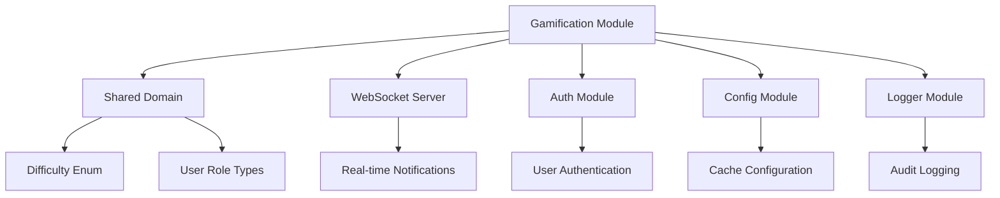
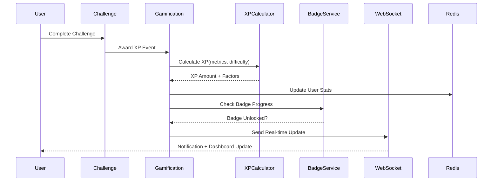

# Módulo de Gamificação (Gamification)

## 1. Visão Geral

### Propósito do Módulo
O módulo de gamificação é o coração da experiência motivacional da plataforma Journey. Ele transforma o aprendizado técnico em uma experiência envolvente através de elementos de jogo como XP, níveis, badges, streaks e leaderboards. Essencialmente, é o que mantém os desenvolvedores engajados e motivados durante sua jornada de crescimento profissional.

### Responsabilidade Principal
- Calcular e atribuir pontos de experiência (XP) baseados em performance e métricas de qualidade
- Gerenciar progressão de níveis com recompensas e desbloqueios
- Implementar sistema de badges com diferentes raridades e categorias
- Manter streaks diárias com proteções e freezes
- Construir leaderboards competitivos globais e por empresa
- Enviar notificações em tempo real para eventos importantes
- Criar dashboard personalizado com métricas consolidadas

### Posição na Arquitetura
O módulo funciona como uma camada de incentivo que se integra com todos os outros módulos da aplicação. Ele consome eventos de:
- Módulo de desafios (conclusão, métricas de performance)
- Módulo de IA (utilização de assistente, independência)
- Módulo de autenticação (atividade diária, dados do usuário)
- Sistema de WebSocket (notificações em tempo real)

## 2. Arquitetura

### Padrões de Design Utilizados

A arquitetura segue Clean Architecture com algumas adaptações específicas para gamificação:
- **Domain Layer**: Entidades ricas em lógica de negócio (Badge, Streak, Level), serviços de domínio especializados
- **Application Layer**: Use cases que orquestram eventos de gamificação e integrações com WebSocket
- **Infrastructure Layer**: Repositórios otimizados com cache Redis, jobs de background, event listeners
- **Presentation Layer**: Controllers REST e WebSocket gateways para real-time

Padrões específicos implementados:
- **Strategy**: `BadgeEvaluationStrategy` para diferentes tipos de verificação de badges
- **Event Sourcing**: Sistema de eventos para XP transactions e badge unlocks
- **Observer**: Event listeners para reagir a ações do usuário em tempo real
- **Cache-Aside**: Cache estratégico para leaderboards e dashboard
- **Builder**: Construção complexa de dados do dashboard com múltiplas fontes

### Dependências de Outros Módulos


### Dependências Externas
- **@prisma/client**: Persistência otimizada para consultas complexas de ranking
- **ioredis**: Cache de alta performance para leaderboards e streaks
- **socket.io**: Notificações em tempo real para usuários conectados
- **zod**: Validação robusta de schemas complexos de gamificação
- **node-cron**: Jobs de background para reset de streaks e limpeza

### Fluxo de Dados


## 3. Estrutura de Arquivos

```
src/modules/gamification/
├── domain/
│   ├── entities/
│   │   ├── badge.entity.ts              # Entidade de badge com lógica de unlock
│   │   ├── streak.entity.ts             # Entidade de streak com proteções
│   │   ├── level.entity.ts              # Entidade de nível com thresholds
│   │   ├── xp-transaction.entity.ts     # Histórico de XP com auditoria
│   │   ├── notification.entity.ts       # Notificações tipadas
│   │   └── leaderboard-entry.entity.ts  # Entries de ranking
│   ├── enums/
│   │   ├── badge-category.enum.ts       # Categorias de badges
│   │   ├── leaderboard.enum.ts          # Tipos e escopos de ranking
│   │   └── websocket-events.enum.ts     # Eventos WebSocket tipados
│   ├── value-objects/
│   │   ├── badge-requirement.vo.ts      # Requirements complexos de badge
│   │   └── leaderboard-key.vo.ts        # Chaves compostas de ranking
│   ├── services/
│   │   ├── xp-calculator.service.ts     # Cálculo avançado de XP
│   │   ├── level-progression.service.ts # Lógica de progressão de níveis
│   │   ├── badge.service.ts             # Orchestração de badges
│   │   ├── leaderboard.service.ts       # Gestão de rankings
│   │   ├── notification.service.ts      # Serviço de notificações
│   │   ├── streak-manager.service.ts    # Gestão completa de streaks
│   │   └── badge-evaluation-strategy.ts # Estratégias de verificação
│   ├── repositories/
│   │   ├── badge.repository.interface.ts    # Contrato para badges
│   │   ├── xp.repository.interface.ts       # Contrato para XP
│   │   ├── streak.repository.interface.ts   # Contrato para streaks
│   │   ├── leaderboard.repository.interface.ts # Contrato para rankings
│   │   └── notification.repository.interface.ts # Contrato para notificações
│   ├── errors/
│   │   ├── index.ts                     # Exportação centralizada
│   │   ├── gamification.error.ts        # Classe base para erros
│   │   ├── badge-*.error.ts             # Erros específicos de badge
│   │   ├── streak-*.error.ts            # Erros específicos de streak
│   │   └── validation.error.ts          # Validações Zod
│   └── types/
│       └── gamification.types.ts        # Interfaces e tipos centrais
├── application/
│   └── use-cases/
│       ├── award-xp.use-case.ts         # Atribuição de XP com eventos
│       ├── calculate-level.use-case.ts  # Cálculo de progressão
│       ├── unlock-badge.use-case.ts     # Unlock de badges
│       ├── get-user-badges.use-case.ts  # Listagem de badges
│       ├── get-leaderboard.use-case.ts  # Rankings paginados
│       ├── get-dashboard.use-case.ts    # Dashboard consolidado
│       ├── get-streak-status.use-case.ts # Status de streak
│       ├── update-streak.use-case.ts    # Atualização de streak
│       ├── freeze-streak.use-case.ts    # Freeze de streak
│       ├── create-notification.use-case.ts # Criação de notificação
│       └── acknowledge-notification.use-case.ts # Acknowledge
├── infrastructure/
│   ├── services/
│   │   └── cache.service.ts             # Redis cache service
│   ├── repositories/
│   │   ├── badge.repository.ts          # Implementação com cache
│   │   ├── xp.repository.ts             # Queries otimizadas
│   │   ├── streak.repository.ts         # Persistência de streaks
│   │   ├── leaderboard.repository.ts    # Rankings com agregações
│   │   └── notification.repository.ts   # Notificações persistidas
│   ├── jobs/
│   │   └── daily-streak-reset.job.ts    # Job de reset diário
│   ├── listeners/
│   │   └── badge.listeners.ts           # Event listeners
│   ├── events/
│   │   └── gamification-events.ts       # Sistema de eventos
│   └── plugin/
│       └── gamification.plugin.ts       # Plugin principal do Fastify
└── presentation/
    ├── controllers/
    │   └── gamification.controller.ts    # Controller REST completo
    └── gateways/
        └── gamification.gateway.ts       # WebSocket gateway
```

## 4. Componentes Principais

### 4.1 GamificationController
Localização: `src/modules/gamification/presentation/controllers/gamification.controller.ts`

Centraliza todos os endpoints REST do módulo de gamificação. Cada método implementa validação completa, error handling padronizado e logging detalhado.

**Métodos principais:**
- `getDashboard()`: Retorna dashboard consolidado com cache inteligente
- `getUserBadges()`: Lista badges do usuário com progresso
- `getLeaderboard()`: Rankings paginados com contexto do usuário
- `getStreakStatus()`: Status completo de streak com previsões
- `getUserNotifications()`: Notificações com paginação e filtros
- `acknowledgeNotification()`: Marca notificações como lidas
- `createNotification()`: Criação de notificações (apenas admins)

```typescript
// Exemplo de uso do dashboard completo
const response = await fetch('/api/gamification/dashboard?includeDetails=true&period=weekly', {
  headers: { 'Authorization': `Bearer ${accessToken}` }
});

const dashboard = await response.json();
// Retorna: user stats, badges recentes, ranking, streak, notificações
```

### 4.2 XPCalculatorService
Localização: `src/modules/gamification/domain/services/xp-calculator.service.ts`

Implementa algoritmo sofisticado de cálculo de XP baseado em múltiplas métricas de qualidade e performance.

**Fatores de cálculo:**
- Base XP por dificuldade (1.0x a 3.0x)
- Performance bonus baseado em DI, Pass Rate e Checklist Score (0.85x a 1.5x)
- First try bonus (1.25x para primeira tentativa)
- Independence bonus baseado no Dependency Index (0.75x a 1.5x)
- Streak bonus progressivo (1.0x a 1.5x para streaks longas)

**Configurações otimizadas:**
- Easy: 1.0x | Medium: 1.5x | Hard: 2.0x | Expert: 3.0x
- Streak milestones: 3, 7, 14, 30+ dias
- Independence thresholds: <30% (expert), 30-50% (avançado), 50-70% (intermediário), >70% (iniciante)

### 4.3 BadgeService
Localização: `src/modules/gamification/domain/services/badge.service.ts`

Gerencia todo o ciclo de vida dos badges: criação, verificação de progresso, unlock automático e notificações.

**Tipos de badges implementados:**
- **Milestone**: Baseados em números absolutos (10 challenges, 100 XP)
- **Streak**: Baseados em consistência (7 dias seguidos, 30 dias)
- **Performance**: Baseados em métricas (DI < 20%, Pass Rate > 90%)
- **Special**: Eventos especiais e conquistas únicas

**Sistema de raridade:**
- Common: Fáceis de obter, motivação inicial
- Rare: Requerem dedicação consistente
- Epic: Conquistas significativas
- Legendary: Marcos excepcionais da carreira

### 4.4 StreakEntity
Localização: `src/modules/gamification/domain/entities/streak.entity.ts`

Entidade rica que encapsula toda a lógica complexa de manutenção de streaks.

**Funcionalidades avançadas:**
- Weekend protection (sexta → segunda não quebra streak)
- Sistema de freeze (2 por usuário, preserva streak)
- Grace period de 4 horas após meia-noite
- Milestones automáticos (3, 7, 14, 30, 60, 100, 365 dias)
- Status tracking (ACTIVE, AT_RISK, BROKEN)

**Regras de negócio:**
- Mínimo de 5 XP + 5 minutos de atividade para contar o dia
- Streak só quebra após 28 horas sem atividade (considerando grace period)
- Weekend protection é opcional e configurável por usuário

### 4.5 LeaderboardService
Localização: `src/modules/gamification/domain/services/leaderboard.service.ts`

Constrói rankings dinâmicos com cache inteligente e atualizações em tempo real.

**Tipos de leaderboard:**
- XP Total (all-time)
- XP Mensal/Semanal
- Streak atual
- Badges desbloqueados

**Escopos disponíveis:**
- Global (todos os usuários)
- Company (apenas empresa do usuário)
- Filtered por roles específicas

### 4.6 GetDashboardUseCase
Localização: `src/modules/gamification/application/use-cases/get-dashboard.use-case.ts`

Orchestração complexa que consolida dados de múltiplas fontes para criar dashboard unificado.

**Dados consolidados:**
- User stats (XP, level, progress para próximo nível)
- Streak status (atual, recorde, próximo milestone)
- Badges recentes e progresso geral
- Ranking posição e mudanças semanais
- Daily goals e progresso
- Notificações não lidas

**Otimizações implementadas:**
- Cache Redis com TTL de 10 minutos
- Promises paralelas para todas as consultas
- Fallbacks graceful para cada componente
- Logging detalhado para monitoring

## 5. Integrações

### 5.1 Com Outros Módulos Internos

**Challenges Module**: A integração mais crítica - o módulo de gamificação escuta eventos de conclusão de desafios e extrai todas as métricas necessárias:
- Dependency Index, Pass Rate, Checklist Score
- Tempo gasto vs. tempo estimado
- Número da tentativa
- Dificuldade do desafio

**Auth Module**: Utiliza dados de autenticação para:
- Identificação do usuário em todos os contextos
- Role-based access para criação de notificações
- Company scoping para leaderboards corporativos

**WebSocket Server**: Integração real-time para:
- Badge unlocks instantâneos
- Atualizações de ranking ao vivo
- Notificações push
- Dashboard updates automáticos

### 5.2 Como Outros Módulos Usam Gamification

```typescript
// Exemplo: Award XP após completar challenge
app.decorate('gamification', {
  awardXP: async (userId: string, challengeData: ChallengeCompletionData) => {
    const xpAwarded = await gamificationController.awardXP.execute({
      userId,
      baseXP: challengeData.difficulty === 'HARD' ? 100 : 50,
      difficulty: challengeData.difficulty,
      metrics: challengeData.metrics,
      timeSpent: challengeData.timeSpent,
      attemptNumber: challengeData.attemptNumber
    });

    // Triggers automatic badge checking and level progression
    return xpAwarded;
  }
});
```

### 5.3 Contratos de Entrada e Saída

**Dashboard Response:**
```typescript
{
  user: {
    id: string;
    currentXP: number;
    level: number;
    levelTitle: string;       // "Junior Developer", "Senior Developer"
    nextLevelXP: number;      // XP needed for next level
    nextLevelProgress: number; // 0-100 percentage
    levelPerks: string[];     // ["Advanced challenges", "Mentor badge"]
  },
  streak: {
    current: number;
    longest: number;
    status: "ACTIVE" | "AT_RISK" | "BROKEN";
    nextMilestone: number;    // 7, 14, 30, 60, etc.
    daysUntilMilestone: number;
    freezesAvailable: number; // 0-2
    willExpireAt: Date;       // When streak will break if no activity
  },
  badges: {
    recent: BadgeInfo[];      // Last 3 unlocked badges
    total: number;            // Total badges available
    unlocked: number;         // User's unlocked count
  },
  ranking: {
    global: number;           // Global position
    company: number;          // Company position
    weeklyChange: number;     // +/- change from last week
  }
}
```

**XP Award Input:**
```typescript
{
  userId: string;
  baseXP: number;             // Base points for the challenge
  difficulty: Difficulty;     // EASY, MEDIUM, HARD, EXPERT
  metrics: {
    dependencyIndex: number;  // 0-100, lower is better
    passRate: number;         // 0-100 percentage
    checklistScore: number;   // 0-10 compliance score
  },
  timeSpent: number;          // Minutes spent on challenge
  estimatedTime: number;      // Expected time for challenge
  attemptNumber: number;      // 1st attempt, 2nd attempt, etc.
  streakDays: number;         // Current streak for bonus calculation
}
```

### 5.4 Endpoints Disponíveis

| Método | Endpoint | Função | Cache? |
|--------|----------|--------|---------|
| GET | `/api/gamification/dashboard` | Dashboard consolidado | 10min |
| GET | `/api/gamification/badges` | Badges do usuário | 5min |
| GET | `/api/gamification/leaderboard` | Rankings dinâmicos | 2min |
| GET | `/api/gamification/streak` | Status de streak | 1min |
| GET | `/api/gamification/notifications` | Notificações do usuário | Não |
| POST | `/api/gamification/notifications/:id/acknowledge` | Marcar como lida | Não |
| POST | `/api/gamification/notifications` | Criar notificação (admin) | Não |

## 6. Tecnologias Utilizadas

### Stack Principal
**Fastify v5.5.0**: Framework escolhido pela performance superior em operações intensivas de leaderboard e real-time updates.

**Redis (ioredis v5.4.2)**: Cache estratégico para:
- Leaderboards (TTL: 2 minutos)
- Dashboard consolidado (TTL: 10 minutos)
- Badge progress tracking (TTL: 5 minutos)
- Session data para WebSocket connections

**Socket.IO v4.9.1**: WebSocket server para notificações real-time:
- Badge unlock notifications
- Ranking position changes
- Streak milestone alerts
- Level up celebrations

**Prisma v6.14.0**: ORM otimizado com:
- Índices específicos para leaderboard queries
- Agregações complexas para estatísticas
- Transações para operações atômicas de XP

### Ferramentas Especializadas
**node-cron v3.0.3**: Jobs de background para:
- Daily streak verification (executa às 00:30 UTC)
- Weekly leaderboard snapshots
- Badge progress batch updates

**Zod v3.25.76**: Validação robusta para:
- Badge requirements complexos
- Leaderboard query parameters
- XP calculation inputs

## 7. Decisões de Design

### 7.1 Sistema de XP Multifatorial
Optamos por um algoritmo de XP que vai muito além do simples "completou = ganhou pontos".

**Por que multifatorial?**
- Incentiva qualidade sobre quantidade (DI baixo vale mais XP)
- Recompensa independência (menos ajuda = mais pontos)
- Mantém motivação para desafios difíceis (multiplicadores progressivos)
- Reconhece consistência (streak bonuses)

**Alternativas que consideramos:**
- **XP fixo por dificuldade**: Muito simples, não incentiva qualidade
- **XP baseado apenas em tempo**: Incentivaria procrastinação
- **XP puramente baseado em métricas**: Muito complexo para usuários entenderem

**Trade-offs assumidos:**
- Algoritmo mais complexo de explicar aos usuários
- Necessita balanceamento constante dos multiplicadores
- Mais complexidade computacional
- Maior precisão na representação de skill real

### 7.2 Cache Strategy em Múltiplas Camadas
Implementamos cache em três níveis para diferentes necessidades de performance.

**Estratégia adotada:**
- **L1 - Application Cache**: Dados calculados (level progression) - 1 hora
- **L2 - Redis Cache**: Dados agregados (leaderboards) - 2-10 minutos
- **L3 - Database**: Source of truth com queries otimizadas

**Raciocínio técnico:**
- Leaderboards são computacionalmente caros mas não mudam constantemente
- Dashboard precisa ser responsivo mas pode ter pequena latência
- Badge progress é crítico para UX mas não precisa ser real-time absoluto

### 7.3 Event-Driven Architecture para Real-time
Sistema de eventos assíncronos para manter gamificação responsiva.

**Motivação:**
- Evitar blocking calls durante completion de challenges
- Permitir multiple listeners para diferentes aspectos (badges, streaks, ranking)
- Facilitar adição de novas funcionalidades sem modificar código existente
- Suportar retry e dead letter queues para reliability

**Implementação:**
```typescript
// Eventos são emitidos automaticamente e processados async
await eventEmitter.emit('challenge.completed', {
  userId,
  challengeData,
  performance: metrics
});

// Multiple listeners podem reagir independentemente
badgeListener.on('challenge.completed', checkBadgeProgress);
streakListener.on('challenge.completed', updateDailyStreak);
leaderboardListener.on('challenge.completed', updateRankings);
```

### 7.4 Streak Design com Grace Periods
Sistema de streak que balancia rigor com realismo da vida dos desenvolvedores.

**Decisões específicas:**
- Grace period de 4 horas após meia-noite (pessoas trabalham até tarde)
- Weekend protection opcional (sexta → segunda não quebra)
- Sistema de freeze limitado (2 por usuário, incentiva uso estratégico)
- Milestones progressivos que criam metas intermediárias

**Inspiração teórica:**
Baseado em pesquisas de behavioral psychology sobre habit formation e no sucesso de apps como Duolingo e GitHub's contribution streaks.

## 8. Limitações e Melhorias Futuras

### 8.1 Limitações Atuais

**Balanceamento de XP Manual**
O sistema atual exige ajustes manuais dos multiplicadores quando percebemos distorções. Falta um sistema automatizado de balanceamento baseado em dados históricos.

**Cache Invalidation Simples**
Atualmente usamos TTL fixo. Em cenários de alta concorrência, isso pode causar cache stampede quando múltiplos usuários disparam recálculo simultâneo de leaderboards.

**Análise de Engajamento Limitada**
Coletamos métricas básicas mas não temos insights profundos sobre quais elementos motivam mais diferentes tipos de desenvolvedores.

### 8.2 Casos Extremos Não Cobertos

1. **Gaming do Sistema**: Usuários podem descobrir formas de maximizar XP sem real aprendizado
2. **Race Conditions**: Badge unlocks simultâneos podem duplicar XP em cenários específicos
3. **Leaderboard Manipulation**: Accounts fake poderiam poluir rankings
4. **Timezone Edge Cases**: Streak logic ainda tem bugs sutis com mudanças de fuso horário

### 8.3 Roadmap de Melhorias

**Adaptive XP Balancing**
Sistema de ML que ajusta multiplicadores baseado em patterns de engajamento:

```typescript
interface AdaptiveBalancer {
  analyzeEngagementPatterns(timeframe: string): EngagementInsights;
  suggestMultiplierAdjustments(currentMultipliers: XPMultipliers): OptimizedMultipliers;
  applyAdjustments(adjustments: MultiplierChanges): Promise<void>;
}
```

**Advanced Badge System**
Badges dinâmicos que se adaptam ao nível do usuário:

```typescript
interface DynamicBadge {
  calculateRequirement(userLevel: number, userMetrics: UserMetrics): BadgeRequirement;
  getProgressHint(currentProgress: number): string;
  predictUnlockTimeframe(currentTrend: PerformanceTrend): EstimatedTime;
}
```

**Social Features**
Elementos sociais para aumentar engajamento:

```typescript
interface SocialGamification {
  createChallengeWithFriends(challengeId: string, friendIds: string[]): TeamChallenge;
  mentorshipBadges(mentorId: string, menteeId: string): MentorshipBadge;
  companyGoals(companyId: string, goal: CompanyGoal): TeamProgress;
}
```

### 8.4 Débito Técnico Conhecido

- Event listeners não têm retry mechanism robusto
- Batch operations para badge updates ainda não implementadas
- Métricas de performance do cache não são expostas para monitoring
- Sistema de notifications não suporta push notifications nativas
- Leaderboard queries não são otimizadas para companias muito grandes (>10k users)

## 9. Testes

### 9.1 Estrutura Atual de Testes

Implementamos testes focados nos algoritmos críticos e integrações complexas.

**Cobertura de testes:**
- XP Calculator: 23 test cases cobrindo todas as combinações de multiplicadores
- Badge Service: 15 test cases para unlock conditions e edge cases
- Streak Entity: 18 test cases para timeline logic e weekend protection
- Dashboard Use Case: 8 test cases para data aggregation

```typescript
describe('XP Calculator Integration Tests', () => {
  beforeEach(async () => {
    await seedTestData(); // Dados conhecidos para assertões precisas
  });

  it('should calculate correct XP for expert challenge with perfect performance', async () => {
    const result = xpCalculator.calculateChallengeXP({
      baseXP: 100,
      difficulty: Difficulty.EXPERT,
      metrics: { dependencyIndex: 15, passRate: 95, checklistScore: 10 },
      timeSpent: 45,
      estimatedTime: 60,
      attemptNumber: 1,
      streakDays: 14
    });

    expect(result.finalXP).toBe(584); // 100 * 3.0 * 1.5 * 1.25 * 1.5 * 1.3
  });
});
```

### 9.2 Cenários de Teste Especializados

**XP Calculation:**
- Todas as combinações de dificuldade × performance × streak
- Edge cases de tempo (muito rápido, muito lento)
- Boundary testing para todos os thresholds

**Badge System:**
- Unlock simultâneo de múltiplos badges
- Progress tracking durante múltiplas sessões
- Validation de requirements complexos

**Streak Logic:**
- Weekend protection em diferentes timezones
- Grace period boundary conditions
- Freeze mechanics com edge cases

### 9.3 Como Executar

```bash
# Testes específicos de gamificação
npm run test:gamification

# Testes de performance para leaderboards
npm run test:performance:leaderboard

# Testes de integração com WebSocket
npm run test:integration:websocket

# Smoke tests para production deploy
npm run test:smoke:gamification
```

**Testes de carga implementados:**
- Leaderboard com 10k+ usuários simultâneos
- Badge unlock em burst scenarios
- Dashboard load com cache miss scenarios

## 10. Exemplos de Uso

### 10.1 Implementação Frontend Completa

```typescript
class GamificationService {
  private socket: Socket;

  constructor() {
    this.socket = io('/gamification');
    this.setupRealTimeListeners();
  }

  setupRealTimeListeners() {
    this.socket.on('badge.unlocked', (badge: BadgeUnlockEvent) => {
      this.showBadgeUnlockModal(badge);
      this.updateUserBadges();
    });

    this.socket.on('level.increased', (levelData: LevelUpEvent) => {
      this.showLevelUpCelebration(levelData);
      this.updateDashboard();
    });

    this.socket.on('streak.milestone', (streakData: StreakMilestoneEvent) => {
      this.showStreakMilestoneNotification(streakData);
    });
  }

  async getDashboard(includeDetails: boolean = true): Promise<DashboardResponse> {
    const response = await this.makeAuthenticatedRequest(
      `/api/gamification/dashboard?includeDetails=${includeDetails}`
    );
    return response.data;
  }

  async getLeaderboard(scope: 'GLOBAL' | 'COMPANY' = 'GLOBAL', page: number = 1) {
    const response = await this.makeAuthenticatedRequest(
      `/api/gamification/leaderboard?scope=${scope}&page=${page}&limit=20`
    );
    return response.data;
  }

  // Método para integrar com completion de challenges
  async handleChallengeCompletion(challengeData: ChallengeCompletionData) {
    // O award XP é chamado automaticamente pelo backend
    // Frontend apenas escuta os eventos real-time de resultado
    await this.waitForGamificationUpdates();
  }

  private async waitForGamificationUpdates(): Promise<void> {
    return new Promise((resolve) => {
      const timeout = setTimeout(resolve, 3000); // Max 3s wait

      const listener = () => {
        clearTimeout(timeout);
        this.socket.off('gamification.updated', listener);
        resolve();
      };

      this.socket.on('gamification.updated', listener);
    });
  }
}
```

### 10.2 Backend Integration nos Challenges

```typescript
// No controller de challenges
class ChallengeController {
  async completeChallenge(request: AuthenticatedRequest, reply: FastifyReply) {
    const { challengeId } = request.params;
    const userId = request.user.id;

    try {
      // 1. Processar completion normal
      const completion = await this.challengeService.completeChallenge(userId, challengeId);

      // 2. Trigger gamification asíncrono (não bloqueia response)
      setImmediate(async () => {
        await request.server.gamification.awardXP.execute({
          userId,
          baseXP: completion.challenge.baseXP,
          difficulty: completion.challenge.difficulty,
          metrics: completion.metrics,
          timeSpent: completion.timeSpent,
          estimatedTime: completion.challenge.estimatedTime,
          attemptNumber: completion.attemptNumber,
          streakDays: await this.getStreakDays(userId)
        });
      });

      // 3. Response imediato para frontend
      return reply.status(200).send({
        success: true,
        data: completion,
        message: 'Challenge completed! XP and badges are being processed...'
      });
    } catch (error) {
      // Error handling...
    }
  }
}
```

### 10.3 Sistema de Notificações Real-time

```typescript
// WebSocket Gateway
class GamificationGateway {
  @SubscribeMessage('dashboard.subscribe')
  async subscribeToDashboard(client: Socket, data: { userId: string }) {
    await client.join(`user:${data.userId}`);

    // Send current dashboard state immediately
    const dashboard = await this.getDashboardUseCase.execute({
      userId: data.userId,
      includeDetails: true
    });

    client.emit('dashboard.initial', dashboard);
  }

  @SubscribeMessage('leaderboard.subscribe')
  async subscribeToLeaderboard(client: Socket, data: { scope: string }) {
    await client.join(`leaderboard:${data.scope}`);

    // Send current leaderboard
    const leaderboard = await this.getLeaderboardUseCase.execute({
      scope: data.scope,
      type: 'XP_TOTAL',
      period: 'ALL_TIME'
    });

    client.emit('leaderboard.update', leaderboard);
  }

  // Called automatically when badge is unlocked
  async broadcastBadgeUnlock(userId: string, badge: BadgeUnlockEvent) {
    this.server.to(`user:${userId}`).emit('badge.unlocked', badge);

    // Also update leaderboards if this affects ranking
    if (badge.xpReward > 0) {
      this.server.to('leaderboard:GLOBAL').emit('leaderboard.position_changed', {
        userId,
        newPosition: await this.getUpdatedPosition(userId, 'GLOBAL')
      });
    }
  }
}
```

### 10.4 Advanced Badge Configuration

```typescript
// Exemplo de badge complexo configurado via admin
const advancedBadge: BadgeConfiguration = {
  key: 'INDEPENDENCE_MASTER',
  name: 'Independence Master',
  description: 'Complete 20 challenges with Dependency Index below 25%',
  icon: 'independence-trophy',
  rarity: 'EPIC',
  category: 'PERFORMANCE',
  requirement: {
    type: 'metrics',
    conditions: [
      {
        metric: 'challenges_completed',
        comparison: 'gte',
        threshold: 20
      },
      {
        metric: 'average_dependency_index',
        comparison: 'lte',
        threshold: 25,
        scope: 'last_20_challenges'
      }
    ]
  },
  xpReward: 200,
  visible: true
};

// Sistema automaticamente avalia este badge após cada challenge completion
```

---

Documentação gerada para TCC - Journey v1.0
Última atualização: 06-10-2025