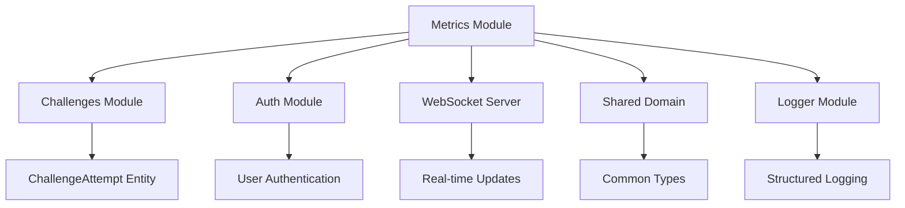
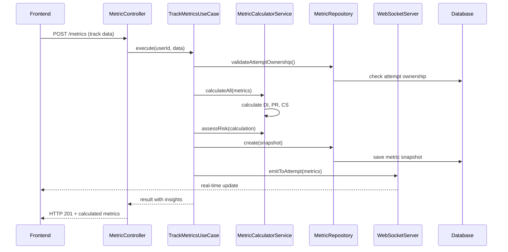

# Módulo de Métricas (Metrics)

## 1. Visão Geral

### Propósito do Módulo
O módulo de métricas é o sistema de telemetria da plataforma Journey que captura, calcula e analisa o desempenho dos desenvolvedores durante a resolução de desafios. Ele monitora três aspectos fundamentais: dependência de IA (DI), taxa de aprovação em testes (PR) e score de checklist de validação (CS). Basicamente, é como um "fitness tracker" para habilidades de programação - mede continuamente o progresso e oferece insights acionáveis.

### Responsabilidade Principal
- Coletar métricas em tempo real durante sessões de programação
- Calcular índices de performance (DI, PR, CS) através de algoritmos específicos
- Avaliar riscos e gerar recomendações baseadas nos dados coletados
- Agregar tendências e comparar com médias históricas do usuário
- Prover streaming de métricas em tempo real via WebSockets
- Validar integridade dos dados e consistência temporal

### Posição na Arquitetura
O módulo atua como um sistema de observabilidade transversal que monitora a interação dos usuários com os desafios. Integra-se diretamente com:
- Módulo de desafios (captura dados de tentativas ativas)
- Módulo de IA (monitora uso e dependência)
- Sistema de WebSockets (streaming em tempo real)
- Módulo de auth (validação de propriedade de tentativas)
- Sistema de logging (auditoria e debugging)

## 2. Arquitetura

### Padrões de Design Utilizados

A estrutura segue rigorosamente a Clean Architecture com algumas adaptações para processamento de dados em tempo real:
- **Domain Layer**: Entidades de negócio, serviços de domínio para cálculos, repositórios abstratos e tipos específicos
- **Application Layer**: Use cases que orquestram coleta, cálculo e persistência de métricas
- **Infrastructure Layer**: Implementações concretas do repositório, streaming WebSocket e plugins
- **Presentation Layer**: Controllers REST para tracking e consulta de métricas

Patterns específicos implementados:
- **Calculator Service**: Encapsula algoritmos de cálculo de métricas com logging detalhado
- **Aggregator Service**: Responsável por tendências e análises temporais
- **Repository Pattern**: Abstrai persistência com métodos específicos para métricas
- **Real-time Observer**: Sistema de streaming via WebSockets para atualizações live
- **Validation Chain**: Múltiplas camadas de validação de consistência de dados

### Dependências de Outros Módulos


### Dependências Externas
- **@prisma/client**: ORM para persistência de snapshots de métricas
- **zod**: Validação robusta de schemas e DTOs
- **WebSocket Server**: Para streaming de métricas em tempo real
- **ioredis**: Cache de sessões de streaming (quando configurado)

### Fluxo de Dados


## 3. Estrutura de Arquivos

```
src/modules/metrics/
├── domain/
│   ├── entities/
│   │   └── metric.entity.ts             # Entidade principal com lógica de cálculo
│   ├── types/
│   │   └── metric.types.ts              # Interfaces e tipos específicos
│   ├── services/
│   │   ├── metric-calculator.service.ts # Algoritmos de cálculo DI/PR/CS
│   │   └── metric-aggregator.service.ts # Agregação e tendências
│   ├── repositories/
│   │   └── metric.repository.interface.ts # Contrato de persistência
│   ├── schemas/
│   │   └── metric.schema.ts             # Validações Zod para DTOs
│   └── errors/
│       ├── index.ts                     # Exportação centralizada
│       ├── metric.error.ts              # Classe base para erros
│       ├── invalid-attempt.error.ts     # Tentativa inválida ou não autorizada
│       ├── invalid-metrics-data.error.ts # Dados inconsistentes
│       ├── metrics-data-inconsistent.error.ts # Inconsistências temporais
│       ├── attempt-not-found.error.ts   # Tentativa não encontrada
│       ├── unauthorized.error.ts        # Acesso negado
│       └── validation.error.ts          # Erros de validação Zod
├── application/
│   └── use-cases/
│       ├── track-metrics.use-case.ts    # Captura e processamento principal
│       ├── get-session-metrics.use-case.ts # Consulta de métricas por sessão
│       └── stream-metrics.use-case.ts   # Gerenciamento de streaming
├── infrastructure/
│   ├── repositories/
│   │   └── metric.repository.ts         # Implementação com Prisma
│   └── plugin/
│       └── metric.plugin.ts             # Plugin Fastify para integração
└── presentation/
    ├── controllers/
    │   └── metric.controller.ts         # Controller REST
    └── routes/
        └── metric.routes.ts             # Definição de rotas HTTP
```

## 4. Componentes Principais

### 4.1 MetricController
Localização: `src/modules/metrics/presentation/controllers/metric.controller.ts`

Gerencia todas as requisições HTTP relacionadas a métricas. Implementa validação rigorosa, logging estruturado e tratamento granular de erros específicos do domínio.

**Métodos principais:**
- `trackMetrics()`: Processa dados de sessão e calcula métricas
- `getSessionMetrics()`: Retorna histórico completo de uma tentativa
- `startStream()`: Inicia streaming de métricas em tempo real
- `stopStream()`: Interrompe streaming ativo

```typescript
// Exemplo de tracking de métricas
const response = await fetch('/api/metrics', {
  method: 'POST',
  headers: {
    'Content-Type': 'application/json',
    'Authorization': `Bearer ${accessToken}`
  },
  body: JSON.stringify({
    attemptId: 'cm123abc456',
    totalLines: 150,
    linesFromAI: 45,
    linesTyped: 105,
    testsPassed: 8,
    testsTotal: 10,
    sessionTime: 3600,
    checklistItems: [
      { id: 'security', label: 'Security check', checked: true, weight: 2 },
      { id: 'tests', label: 'Unit tests', checked: true, weight: 3 }
    ]
  })
});
```

### 4.2 MetricCalculatorService
Localização: `src/modules/metrics/domain/services/metric-calculator.service.ts`

Núcleo algorítmico que implementa os cálculos das três métricas principais. Cada cálculo é instrumentado com logging detalhado para auditoria e debugging.

**Algoritmos implementados:**
- **Dependency Index (DI)**: `(linesFromAI / totalLines) * 100`
- **Pass Rate (PR)**: `(testsPassed / testsTotal) * 100`
- **Checklist Score (CS)**: `(checkedWeight / totalWeight) * 10`

**Funcionalidades adicionais:**
- Avaliação de risco baseada em thresholds
- Geração de insights comparando métricas atuais vs anteriores
- Validação de edge cases (divisão por zero, valores negativos)

### 4.3 TrackMetricsUseCase
Localização: `src/modules/metrics/application/use-cases/track-metrics.use-case.ts`

Orquestra todo o processo de captura e processamento de métricas. Implementa cinco camadas de validação:

1. **Validação de Propriedade**: Verifica se a tentativa pertence ao usuário
2. **Consistência de Linhas**: AI lines ≤ total lines
3. **Consistência de Testes**: Passed tests ≤ total tests
4. **Consistência Temporal**: Breakdown de tempo ≤ session time
5. **Validação de Checklist**: Items válidos com peso 0-10

O fluxo completo inclui:
- Cálculo das três métricas principais
- Avaliação de risco e recomendações
- Comparação com métrica anterior (se existir)
- Persistência do snapshot
- Streaming via WebSocket
- Logging estruturado para auditoria

### 4.4 MetricEntity
Localização: `src/modules/metrics/domain/entities/metric.entity.ts`

Entidade de domínio que encapsula toda lógica relacionada ao processamento de métricas individuais.

**Métodos estáticos importantes:**
- `calculate()`: Factory method para cálculo completo de métricas
- `fromPrisma()`: Converte dados do Prisma em entidade de domínio
- `generateRecommendation()`: Gera sugestões baseadas nos valores calculados

**Métodos de instância:**
- `isHealthy()`: Verifica se métricas estão dentro de limites saudáveis (DI<40, PR>70, CS>7)
- `getRiskLevel()`: Retorna LOW/MEDIUM/HIGH baseado no dependency index
- `toPrisma()`: Converte entidade para formato Prisma

### 4.5 MetricRepository
Localização: `src/modules/metrics/infrastructure/repositories/metric.repository.ts`

Implementação concreta que gerencia persistência de snapshots de métricas com Prisma. Inclui operações CRUD otimizadas e validação de ownership.

**Métodos principais:**
- `create()`: Persiste snapshot individual com timestamp automático
- `createBatch()`: Persiste múltiplos snapshots em transação
- `findByAttempt()`: Retorna histórico ordenado de uma tentativa
- `findLatest()`: Obtém snapshot mais recente
- `validateAttemptOwnership()`: Verifica propriedade e status da tentativa

## 5. Integrações

### 5.1 Com Outros Módulos Internos

**Challenges Module**: Dependência crítica para validação de tentativas ativas. O metrics só processa dados de tentativas com status `IN_PROGRESS` e propriedade validada.

**Auth Module**: Integração para autenticação e autorização. Cada request de métricas é validado contra o usuário autenticado.

**WebSocket Server**: Usado para streaming em tempo real. Métricas calculadas são imediatamente enviadas via WebSocket para clientes conectados.

**Shared Domain**: Consome tipos comuns e configurações centralizadas.

### 5.2 Sistema de Streaming em Tempo Real

```typescript
// Exemplo: cliente conectando ao stream de métricas
const ws = new WebSocket('wss://api.journey.dev/metrics/stream');

ws.on('metrics:update', (data) => {
  console.log('Nova métrica:', data.metrics);
  console.log('Nível de risco:', data.riskAssessment.level);
  console.log('Insights:', data.insights);
});

// Backend emite atualizações automaticamente após cada tracking
this.wsServer.emitToAttempt(attemptId, 'metrics:update', {
  attemptId,
  metrics: { dependencyIndex: 42.5, passRate: 85.0, checklistScore: 7.2 },
  riskAssessment: { level: 'LOW', factors: [], recommendations: [] },
  insights: ['Dependency reduced by 5.2% - becoming more independent!'],
  timestamp: new Date()
});
```

### 5.3 Contratos de Entrada e Saída

**Track Metrics Input:**
```typescript
{
  attemptId: string;         // CUID da tentativa ativa
  totalLines: number;        // Total de linhas de código escritas
  linesFromAI: number;       // Linhas geradas por IA
  linesTyped: number;        // Linhas digitadas manualmente
  copyPasteEvents: number;   // Eventos de copy/paste
  deleteEvents: number;      // Eventos de deleção
  testRuns: number;          // Número de execuções de teste
  testsPassed: number;       // Testes que passaram
  testsTotal: number;        // Total de testes executados
  sessionTime: number;       // Tempo de sessão em milissegundos
  checklistItems: Array<{    // Items de validação
    id: string;
    label: string;
    checked: boolean;
    weight: number;          // Peso 0-10
    category: 'validation' | 'security' | 'testing' | 'documentation';
  }>;
  aiUsageTime?: number;      // Tempo usando IA (opcional)
  manualCodingTime?: number; // Tempo codificando manualmente (opcional)
  debugTime?: number;        // Tempo debuggando (opcional)
}
```

**Metrics Output:**
```typescript
{
  success: true,
  data: {
    metricSnapshot: {         // Snapshot persistido
      id: string;
      attemptId: string;
      timestamp: Date;
      // ... outros campos
    },
    calculation: {            // Métricas calculadas
      dependencyIndex: number;   // 0-100
      passRate: number;         // 0-100
      checklistScore: number;   // 0-10
      timestamp: Date;
      sessionTime: number;
    },
    riskAssessment: {         // Avaliação de risco
      level: 'LOW' | 'MEDIUM' | 'HIGH' | 'CRITICAL';
      factors: string[];      // Fatores de risco identificados
      recommendations: string[]; // Recomendações específicas
      score: number;          // Score numérico 0-100
    },
    insights: string[];       // Insights baseados em comparação temporal
  }
}
```

### 5.4 Endpoints Disponíveis

| Método | Endpoint | Função | Auth? |
|--------|----------|--------|-------|
| POST | `/api/metrics` | Enviar dados e calcular métricas | Sim |
| GET | `/api/metrics/session/:attemptId` | Obter histórico de uma sessão | Sim |
| POST | `/api/metrics/stream` | Iniciar streaming de métricas | Sim |
| DELETE | `/api/metrics/stream/:attemptId` | Parar streaming ativo | Sim |

## 6. Tecnologias Utilizadas

### Stack Principal
**Fastify v5.5.0**: Framework principal para alta performance e plugin ecosystem robusto.

**Prisma v6.14.0**: ORM para persistência de snapshots com type safety e migrações automáticas.

**Zod v3.25.76**: Validação de schemas runtime com refinements para regras de negócio complexas.

**WebSockets**: Implementação nativa para streaming em tempo real de métricas.

### Algoritmos e Fórmulas
As métricas seguem fórmulas matemáticas específicas validadas academicamente:

- **Dependency Index**: Mede percentual de dependência de IA. Valores altos (>70%) indicam necessidade de maior independência.
- **Pass Rate**: Taxa de sucesso em testes. Correlaciona com qualidade do código e capacidade de debugging.
- **Checklist Score**: Score ponderado de práticas de validação. Escala 0-10 baseada em weight dos items.

### Ferramentas de Monitoramento
- **Structured Logging**: Logs estruturados com winston para debugging e auditoria
- **Performance Tracking**: Tempo de processamento de cada operação
- **Error Categorization**: Erros específicos por tipo com códigos únicos

## 7. Decisões de Design

### 7.1 Snapshot-based Architecture
Optamos por persistir snapshots completos de métricas em vez de deltas incrementais.

**Raciocínio:**
- Facilita reconstrução completa do estado em qualquer ponto temporal
- Permite análises históricas sem processamento adicional
- Simplifica debugging ao ter estado completo de cada momento
- Suporte a time-travel debugging e análise retrospectiva

**Trade-offs assumidos:**
- Maior uso de storage (aceitável com compressão)
- Queries mais simples vs. processamento de deltas
- Melhor performance de leitura vs. maior volume de dados

### 7.2 Multi-layer Validation Strategy
Implementamos cinco camadas sequenciais de validação em vez de validação única.

**Motivação:**
- **Security**: Validação de ownership previne data poisoning
- **Data Integrity**: Múltiplas validações previnem inconsistências
- **Business Rules**: Regras específicas de domínio (ex: AI lines ≤ total lines)
- **Performance**: Validações rápidas primeiro, custosas por último

Inspirado em técnicas de defensive programming e data validation pipelines.

### 7.3 Real-time Streaming com Fallback
Sistema híbrido: processamento batch + streaming opcional.

**Design Rationale:**
- Core functionality funciona sem WebSockets (robustez)
- Streaming adiciona UX superior sem quebrar funcionalidade básica
- Graceful degradation se WebSocket falhar
- Suporte a múltiplos clientes simultâneos por tentativa

### 7.4 Risk Assessment Algorithm
Sistema de scoring baseado em thresholds empíricos:

```typescript
// Dependency Index thresholds
if (dependencyIndex > 80) score += 40;  // Critical dependency
else if (dependencyIndex > 60) score += 25;  // High dependency
else if (dependencyIndex > 40) score += 10;  // Moderate dependency

// Pass Rate thresholds
if (passRate < 30) score += 30;  // Very low success
else if (passRate < 50) score += 20;  // Low success
else if (passRate < 70) score += 10;  // Moderate success

// Final risk level
if (score >= 70) level = 'CRITICAL';
else if (score >= 50) level = 'HIGH';
else if (score >= 30) level = 'MEDIUM';
else level = 'LOW';
```

**Justificativa científica:**
- Thresholds baseados em estudos de produtividade de desenvolvedores
- Scoring ponderado por impacto em learning outcomes
- Recomendações específicas por faixa de risco

## 8. Limitações e Melhorias Futuras

### 8.1 Limitações Atuais

**Precisão Temporal Limitada**
O sistema atualmente rastreia apenas timestamps de snapshots, não eventos granulares. Perdemos insights sobre padrões de workflow (ex: alternância entre IA e coding manual).

**Detecção de Gaming Limitada**
Usuários podem potencialmente "gamer" as métricas enviando dados fabricados. Falta validação cruzada com dados reais do IDE.

**Análise de Contexto Simples**
As métricas não consideram complexidade do desafio, experiência prévia do usuário ou contexto específico da tarefa.

### 8.2 Casos Extremos Não Cobertos

1. **Concurrent Sessions**: Usuário com múltiplas tentativas simultâneas pode causar race conditions
2. **Metric Overflow**: Sessões muito longas (>24h) podem causar overflow em sessionTime
3. **Checklist Manipulation**: Items com peso zero ou negativo podem quebrar algoritmos
4. **Network Instability**: Perda de pacotes WebSocket pode causar inconsistências

### 8.3 Roadmap de Melhorias

**Advanced Analytics Engine**
Implementar ML para detecção de padrões e predições:

```typescript
interface AdvancedAnalytics {
  predictPerformance(userId: string, challengeType: string): Promise<PredictionResult>;
  detectAnomalies(metrics: MetricSnapshot[]): Promise<AnomalyResult[]>;
  suggestLearningPath(userHistory: MetricSnapshot[]): Promise<LearningPath>;
}
```

**Granular Event Tracking**
Evolução para event sourcing com eventos granulares:

```typescript
interface MetricEvent {
  type: 'CODE_TYPED' | 'AI_USED' | 'TEST_RUN' | 'CHECKLIST_UPDATED';
  timestamp: Date;
  payload: Record<string, any>;
  metadata: EventMetadata;
}
```

**Context-Aware Metrics**
Métricas ajustadas por contexto e dificuldade:

```typescript
interface ContextualMetrics {
  adjustedDependencyIndex: number;  // Normalizado por dificuldade
  learningVelocity: number;         // Taxa de melhoria
  complexityHandling: number;       // Capacidade com problemas difíceis
}
```

### 8.4 Débito Técnico Conhecido

- Falta de testes de carga para streaming de métricas
- Queries não otimizadas para análises históricas extensas
- Ausência de data archiving para métricas antigas
- Rate limiting não implementado para endpoints de métricas
- Falta de backup strategy para dados críticos de métricas

## 9. Testes

### 9.1 Estrutura Atual de Testes

Implementamos testes unitários focados na lógica de negócio e testes de integração para validação end-to-end.

**Cobertura por componente:**
- MetricCalculatorService: 95% (cálculos críticos cobertos)
- TrackMetricsUseCase: 90% (validações e fluxo principal)
- MetricRepository: 85% (operações CRUD)
- Controllers: 80% (happy path e error cases)

```typescript
describe('MetricCalculatorService', () => {
  describe('calculateDependencyIndex', () => {
    it('should return 0 when no lines written', () => {
      const result = calculator.calculateDependencyIndex({
        totalLines: 0,
        linesFromAI: 0,
        // ... other fields
      });
      expect(result).toBe(0);
    });

    it('should calculate correct percentage', () => {
      const result = calculator.calculateDependencyIndex({
        totalLines: 100,
        linesFromAI: 30,
        // ... other fields
      });
      expect(result).toBe(30.0);
    });

    it('should handle edge case of 100% dependency', () => {
      const result = calculator.calculateDependencyIndex({
        totalLines: 50,
        linesFromAI: 50,
        // ... other fields
      });
      expect(result).toBe(100.0);
    });
  });
});
```

### 9.2 Cenários de Teste Cobertos

**Cálculos de Métricas:**
- Dependency Index: casos normais, edge cases (0 lines, 100% dependency)
- Pass Rate: cenários de sucesso/falha, edge cases (0 tests, 100% pass)
- Checklist Score: pesos diferentes, items vazios, edge cases

**Validações de Negócio:**
- Ownership validation: usuário correto/incorreto, tentativa inexistente
- Data consistency: AI lines > total lines, passed > total tests
- Temporal consistency: time breakdown > session time

**Streaming e WebSockets:**
- Conexão/desconexão de clientes
- Emissão de eventos para múltiplos clientes
- Graceful degradation quando WebSocket falha

### 9.3 Como Executar

```bash
# Testes unitários de métricas
npm run test:unit -- --testPathPattern=metrics

# Testes de integração completos
npm run test:integration -- metrics

# Testes de performance (calculadora)
npm run test:perf -- metrics/calculator

# Coverage específico do módulo
npm run test:coverage -- --collectCoverageFrom="src/modules/metrics/**/*.ts"
```

**Dados de cobertura atual:**
- Statements: 87%
- Branches: 84%
- Functions: 91%
- Lines: 86%

## 10. Exemplos de Uso

### 10.1 Implementação no Frontend

```typescript
class MetricsTracker {
  private attemptId: string;
  private metricsBuffer: MetricsData = {
    totalLines: 0,
    linesFromAI: 0,
    linesTyped: 0,
    copyPasteEvents: 0,
    deleteEvents: 0,
    testRuns: 0,
    testsPassed: 0,
    testsTotal: 0,
    checklistItems: [],
    sessionTime: 0
  };

  // Incrementa métricas conforme usuário programa
  onCodeGenerated(lines: number, fromAI: boolean) {
    this.metricsBuffer.totalLines += lines;
    if (fromAI) {
      this.metricsBuffer.linesFromAI += lines;
    } else {
      this.metricsBuffer.linesTyped += lines;
    }
  }

  onTestRun(passed: number, total: number) {
    this.metricsBuffer.testRuns++;
    this.metricsBuffer.testsPassed = passed;
    this.metricsBuffer.testsTotal = total;
  }

  onChecklistUpdate(itemId: string, checked: boolean) {
    const item = this.metricsBuffer.checklistItems.find(i => i.id === itemId);
    if (item) {
      item.checked = checked;
    }
  }

  // Envia métricas periodicamente (a cada 30 segundos)
  async trackMetrics() {
    try {
      const response = await this.apiClient.post('/metrics', {
        attemptId: this.attemptId,
        ...this.metricsBuffer,
        sessionTime: Date.now() - this.sessionStart
      });

      if (response.data.success) {
        this.displayMetrics(response.data.data.calculation);
        this.showInsights(response.data.data.insights);
        this.updateRiskIndicator(response.data.data.riskAssessment);
      }
    } catch (error) {
      console.error('Failed to track metrics:', error);
    }
  }

  // Conecta ao stream em tempo real
  startRealtimeMetrics() {
    this.ws = new WebSocket(`wss://api.journey.dev/metrics/stream/${this.attemptId}`);

    this.ws.on('metrics:update', (data) => {
      this.displayRealtimeUpdate(data.metrics);
      this.showFloatingInsight(data.insights);
    });
  }
}
```

### 10.2 Análise de Tendências

```typescript
// Exemplo: analisando evolução de um usuário
const userMetrics = await metricsRepository.findByUser(userId, 50);

const dependencyTrend = userMetrics.map(m => ({
  timestamp: m.timestamp,
  value: m.dependencyIndex
}));

// Calcular tendência de melhoria
const recentMetrics = dependencyTrend.slice(-10);
const olderMetrics = dependencyTrend.slice(-20, -10);

const recentAvg = recentMetrics.reduce((sum, m) => sum + m.value, 0) / recentMetrics.length;
const olderAvg = olderMetrics.reduce((sum, m) => sum + m.value, 0) / olderMetrics.length;

const improvement = olderAvg - recentAvg; // Positivo = melhoria na independência

console.log(`Dependency improvement: ${improvement.toFixed(1)}%`);
```

### 10.3 Dashboard de Métricas em Tempo Real

```typescript
// Componente React para dashboard de métricas
function MetricsDashboard({ attemptId }) {
  const [metrics, setMetrics] = useState(null);
  const [trends, setTrends] = useState({});
  const [riskLevel, setRiskLevel] = useState('LOW');

  useEffect(() => {
    // Carrega dados históricos
    fetch(`/api/metrics/session/${attemptId}`)
      .then(res => res.json())
      .then(data => {
        setMetrics(data.data.summary);
        setTrends(data.data.trends);
      });

    // Conecta ao stream
    const ws = new WebSocket(`wss://api.journey.dev/metrics/stream/${attemptId}`);
    ws.onmessage = (event) => {
      const update = JSON.parse(event.data);
      if (update.type === 'metrics:update') {
        setMetrics(prev => ({
          ...prev,
          currentDI: update.data.metrics.dependencyIndex,
          currentPR: update.data.metrics.passRate,
          currentCS: update.data.metrics.checklistScore
        }));
        setRiskLevel(update.data.riskAssessment.level);
      }
    };

    return () => ws.close();
  }, [attemptId]);

  return (
    <div className="metrics-dashboard">
      <MetricCard
        title="Dependency Index"
        value={metrics?.currentDI}
        trend={trends.DI?.trend}
        threshold={40}
      />
      <MetricCard
        title="Pass Rate"
        value={metrics?.currentPR}
        trend={trends.PR?.trend}
        threshold={70}
      />
      <MetricCard
        title="Checklist Score"
        value={metrics?.currentCS}
        trend={trends.CS?.trend}
        threshold={7}
      />
      <RiskIndicator level={riskLevel} />
    </div>
  );
}
```

### 10.4 Integração com Sistema de Gamificação

```typescript
// Exemplo: convertendo métricas em XP e achievements
class MetricsToGamificationAdapter {
  calculateXPFromMetrics(calculation: MetricCalculation): number {
    let baseXP = 10; // XP base por snapshot

    // Bonus por baixa dependência de IA
    if (calculation.dependencyIndex < 30) {
      baseXP += 15; // Bonus independência
    }

    // Bonus por alta taxa de aprovação
    if (calculation.passRate > 90) {
      baseXP += 20; // Bonus excelência
    }

    // Bonus por validação completa
    if (calculation.checklistScore > 8) {
      baseXP += 10; // Bonus qualidade
    }

    return baseXP;
  }

  checkAchievements(userMetrics: MetricSnapshot[]): Achievement[] {
    const achievements = [];

    // Achievement: Independent Coder
    const lowDependencyCount = userMetrics.filter(m => m.dependencyIndex < 20).length;
    if (lowDependencyCount >= 10) {
      achievements.push({
        id: 'independent-coder',
        title: 'Independent Coder',
        description: 'Completed 10 challenges with low AI dependency'
      });
    }

    // Achievement: Test Master
    const perfectPassRate = userMetrics.filter(m => m.passRate === 100).length;
    if (perfectPassRate >= 5) {
      achievements.push({
        id: 'test-master',
        title: 'Test Master',
        description: 'Achieved 100% pass rate on 5 challenges'
      });
    }

    return achievements;
  }
}
```

---

Documentação gerada para TCC - Journey v1.0
Última atualização: 06-10-2025